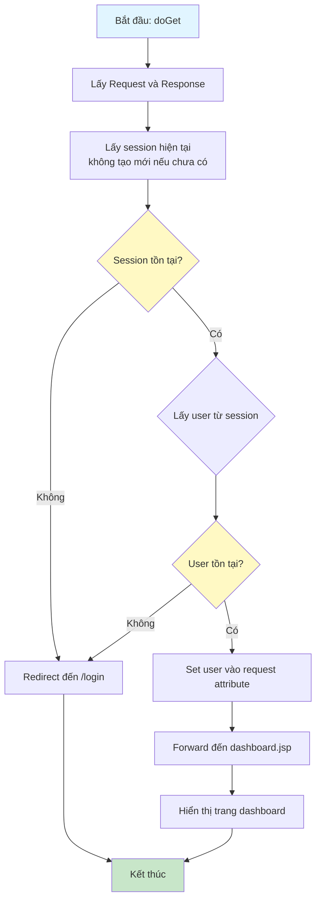

# Sơ Đồ Luồng Hoạt Động - DashboardServlet

## Mô tả
Servlet xử lý trang dashboard sau khi đăng nhập. Yêu cầu người dùng phải đăng nhập để truy cập.

## Sơ Đồ Luồng - Phương Thức doGet

## Chi Tiết Các Bước

### 1. Kiểm Tra Đăng Nhập
- Lấy session hiện tại (không tạo mới)
- Kiểm tra xem có user trong session không

### 2. Bảo Vệ Trang
- Nếu chưa đăng nhập (không có session hoặc không có user), redirect đến trang đăng nhập
- Đảm bảo chỉ người dùng đã đăng nhập mới có thể truy cập dashboard

### 3. Hiển Thị Dashboard
- Nếu đã đăng nhập, lấy user từ session
- Set user vào request attribute để hiển thị thông tin trong JSP
- Forward đến `/WEB-INF/views/dashboard.jsp`

### 4. Lưu Ý
- Trang này được bảo vệ bởi AuthFilter, nhưng servlet cũng kiểm tra lại để đảm bảo an toàn
- Dashboard là trang chính sau khi đăng nhập thành công

