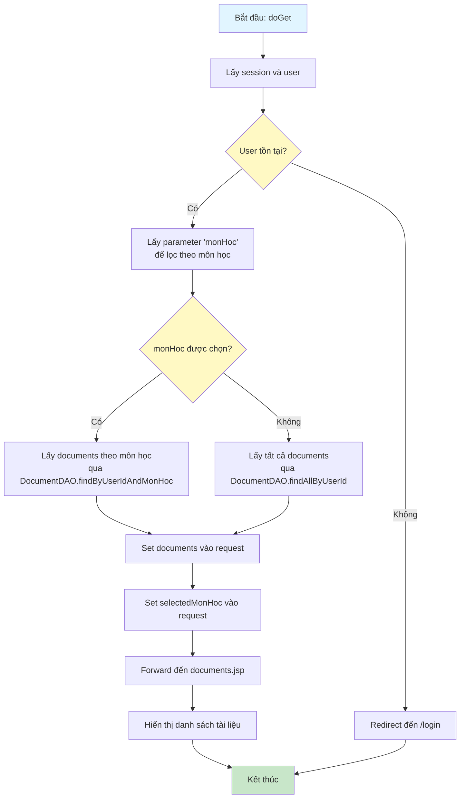
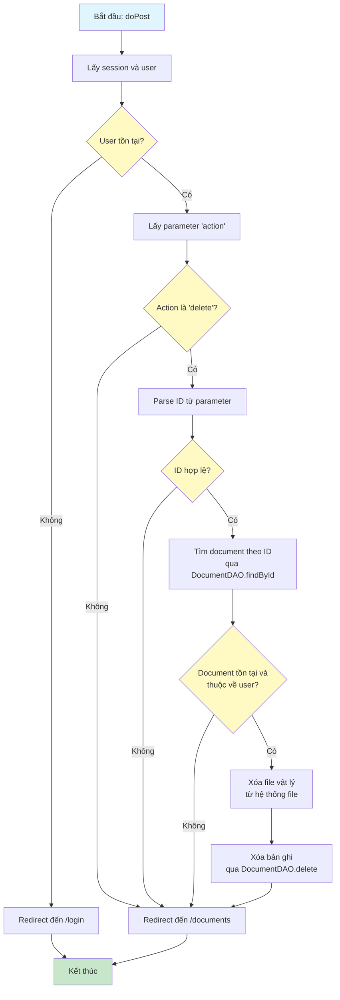

# Sơ Đồ Luồng Hoạt Động - DocumentServlet

## Mô tả
Servlet xử lý quản lý tài liệu của người dùng. Hỗ trợ GET để hiển thị danh sách và POST để xóa tài liệu.

## Sơ Đồ Luồng - Phương Thức doGet

## Sơ Đồ Luồng - Phương Thức doPost

## Chi Tiết Các Bước

### 1. Hiển Thị Danh Sách Tài Liệu (doGet)
- Lấy tất cả tài liệu của user hoặc lọc theo môn học nếu có parameter
- Sắp xếp theo thời gian upload (mới nhất trước)
- Hiển thị danh sách với thông tin: tên file, môn học, kích thước, ngày upload

### 2. Xóa Tài Liệu (doPost)
- Kiểm tra quyền sở hữu document
- Xóa file vật lý từ thư mục uploads
- Xóa bản ghi trong database
- Redirect về trang danh sách tài liệu

### 3. Lọc Theo Môn Học
- Hỗ trợ lọc danh sách tài liệu theo môn học
- Giúp người dùng dễ dàng tìm kiếm tài liệu theo từng môn

