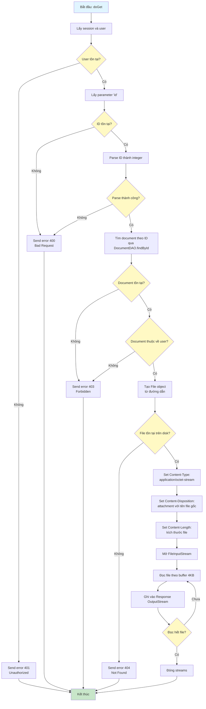

# Sơ Đồ Luồng Hoạt Động - DownloadDocumentServlet

## Mô tả
Servlet xử lý download tài liệu từ server. Chỉ hỗ trợ GET, yêu cầu đăng nhập và kiểm tra quyền sở hữu.

## Sơ Đồ Luồng - Phương Thức doGet

## Chi Tiết Các Bước

### 1. Kiểm Tra Đăng Nhập
- Xác thực user đã đăng nhập, nếu không trả về 401 Unauthorized

### 2. Validate ID
- Kiểm tra parameter ID có tồn tại
- Parse ID thành integer, nếu không hợp lệ trả về 400 Bad Request

### 3. Kiểm Tra Quyền Sở Hữu
- Tìm document theo ID trong database
- Kiểm tra document thuộc về user hiện tại
- Nếu không tìm thấy hoặc không thuộc về user, trả về 403 Forbidden

### 4. Kiểm Tra File Vật Lý
- Tạo File object từ đường dẫn lưu trong database
- Kiểm tra file có tồn tại trên disk
- Nếu không tồn tại, trả về 404 Not Found

### 5. Stream File
- Set các HTTP headers phù hợp:
  - Content-Type: application/octet-stream
  - Content-Disposition: attachment với tên file gốc
  - Content-Length: kích thước file
- Đọc file theo buffer 4KB để tối ưu bộ nhớ
- Ghi từng buffer vào Response OutputStream
- Đóng streams sau khi hoàn thành

### 6. Bảo Mật
- Chỉ cho phép download file của chính user
- Kiểm tra file tồn tại trước khi stream
- Sử dụng tên file gốc trong header để người dùng nhận được tên file đúng

