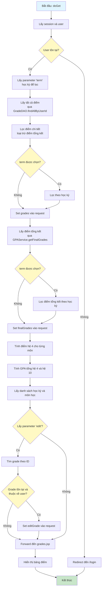
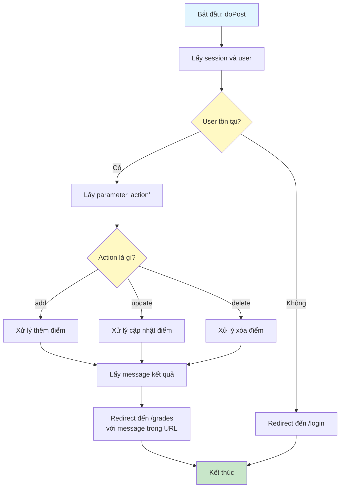
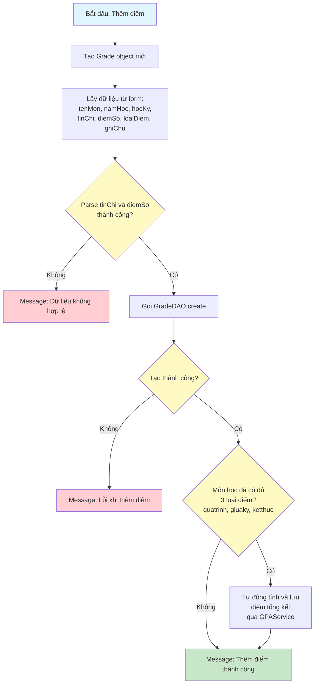
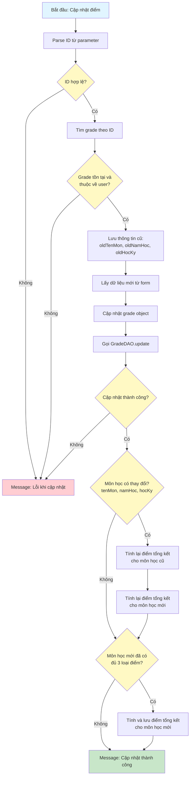
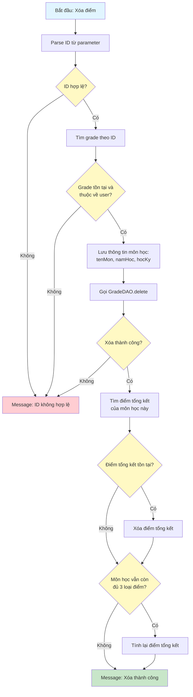

# Sơ Đồ Luồng Hoạt Động - GradeServlet

## Mô tả
Servlet xử lý quản lý điểm số của người dùng. Hỗ trợ GET để hiển thị danh sách điểm và POST để thêm/sửa/xóa điểm.

## Sơ Đồ Luồng - Phương Thức doGet

## Sơ Đồ Luồng - Phương Thức doPost

## Sơ Đồ Luồng - Xử Lý Thêm Điểm (action=add)

## Sơ Đồ Luồng - Xử Lý Cập Nhật Điểm (action=update)

## Sơ Đồ Luồng - Xử Lý Xóa Điểm (action=delete)

## Chi Tiết Các Bước

### 1. Hiển Thị Danh Sách Điểm (doGet)
- Lấy tất cả điểm của user
- Phân loại: điểm chi tiết (quá trình, giữa kỳ, kết thúc) và điểm tổng kết
- Tính điểm hệ 4 cho từng môn và GPA tổng
- Hỗ trợ lọc theo học kỳ

### 2. Thêm Điểm
- Validate và parse dữ liệu đầu vào
- Tạo điểm mới trong database
- Tự động tính và lưu điểm tổng kết nếu môn học đã có đủ 3 loại điểm

### 3. Cập Nhật Điểm
- Kiểm tra quyền sở hữu
- Cập nhật điểm trong database
- Nếu môn học thay đổi, tính lại điểm tổng kết cho cả môn cũ và môn mới
- Nếu môn học mới đủ 3 loại điểm, tự động tính điểm tổng kết

### 4. Xóa Điểm
- Kiểm tra quyền sở hữu
- Xóa điểm khỏi database
- Xóa điểm tổng kết tương ứng nếu có
- Nếu môn học vẫn còn đủ 3 loại điểm, tính lại điểm tổng kết

### 5. Tính Điểm Tự Động
- Hệ thống tự động tính điểm tổng kết khi:
  - Thêm điểm và môn học đã có đủ 3 loại
  - Cập nhật điểm và môn học mới đủ 3 loại
  - Xóa điểm nhưng môn học vẫn còn đủ 3 loại

