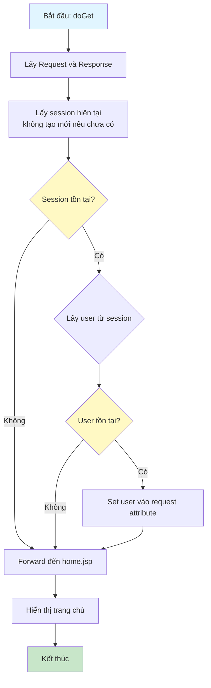
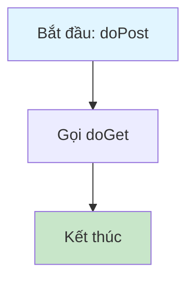

# Sơ Đồ Luồng Hoạt Động - HomeServlet

## Mô tả
Servlet xử lý trang chủ của ứng dụng. Hiển thị trang home.jsp, có thể xem được cả khi chưa đăng nhập.

## Sơ Đồ Luồng - Phương Thức doGet

## Sơ Đồ Luồng - Phương Thức doPost

## Chi Tiết Các Bước

### 1. Kiểm Tra Session
- Lấy session hiện tại mà không tạo mới nếu chưa có
- Điều này cho phép trang chủ hiển thị được cả khi chưa đăng nhập

### 2. Lấy Thông Tin User
- Nếu có session và có user trong session, lấy user ra
- Set user vào request attribute để hiển thị trong JSP

### 3. Hiển Thị Trang Chủ
- Forward request đến `/WEB-INF/views/home.jsp`
- Trang chủ có thể hiển thị thông tin user nếu đã đăng nhập, hoặc hiển thị thông tin chung nếu chưa đăng nhập

### 4. URL Patterns
- Servlet được map với các URL: `/` và `/home`
- Cả hai đều trỏ đến cùng một trang chủ

