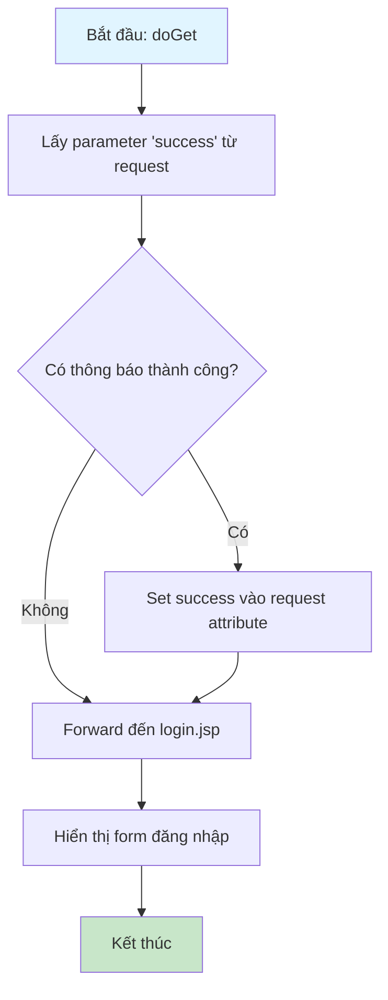
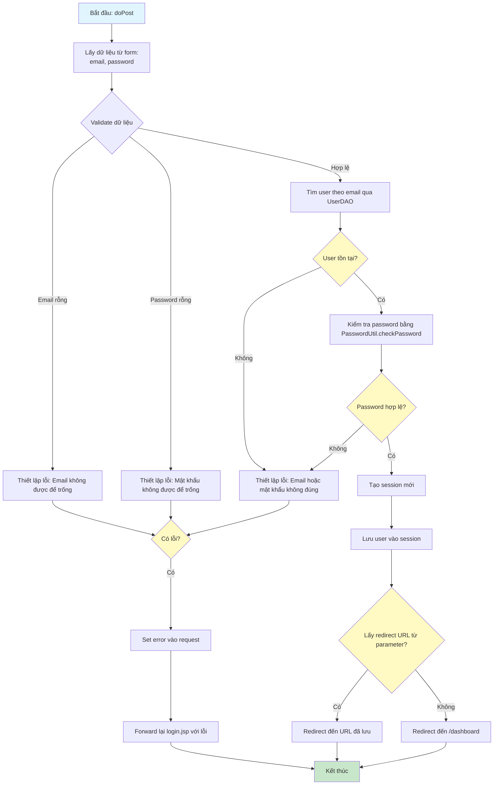

# Sơ Đồ Luồng Hoạt Động - LoginServlet

## Mô tả
Servlet xử lý đăng nhập người dùng. Hỗ trợ GET để hiển thị form đăng nhập và POST để xử lý đăng nhập.

## Sơ Đồ Luồng - Phương Thức doGet

## Sơ Đồ Luồng - Phương Thức doPost

## Chi Tiết Các Bước

### 1. Validate Dữ Liệu
- Kiểm tra email không được rỗng
- Kiểm tra mật khẩu không được rỗng

### 2. Xác Thực Người Dùng
- Tìm user theo email sử dụng `UserDAO.findByEmail()`
- Kiểm tra password bằng `PasswordUtil.checkPassword()` với BCrypt

### 3. Tạo Session
- Tạo HttpSession mới
- Lưu đối tượng User vào session để sử dụng cho các request sau

### 4. Redirect
- Nếu có parameter `redirect`, chuyển hướng đến URL đó
- Nếu không, chuyển hướng đến trang dashboard

### 5. Xử Lý Lỗi
- Nếu email hoặc password không đúng, hiển thị thông báo lỗi chung để bảo mật
- Forward lại form đăng nhập với thông báo lỗi

