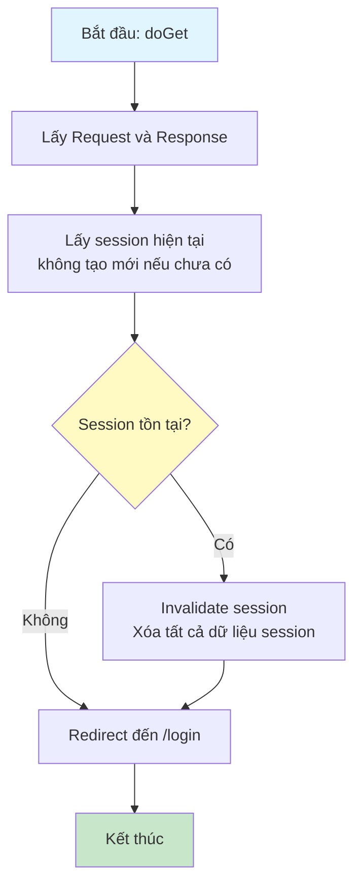
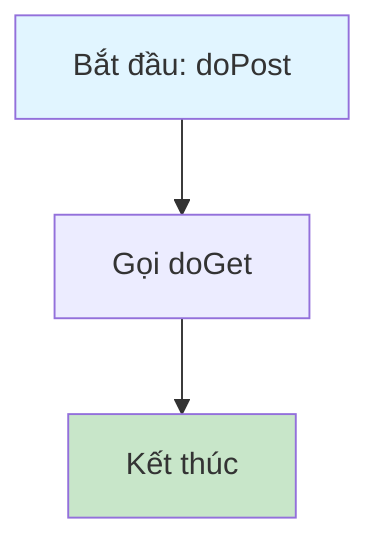

# Sơ Đồ Luồng Hoạt Động - LogoutServlet

## Mô tả
Servlet xử lý đăng xuất người dùng. Xóa session và chuyển hướng về trang đăng nhập.

## Sơ Đồ Luồng - Phương Thức doGet

## Sơ Đồ Luồng - Phương Thức doPost

## Chi Tiết Các Bước

### 1. Lấy Session
- Sử dụng `request.getSession(false)` để lấy session hiện tại
- Không tạo session mới nếu chưa có (false)

### 2. Xóa Session
- Nếu session tồn tại, gọi `session.invalidate()` để xóa hoàn toàn
- Điều này xóa tất cả dữ liệu trong session, bao gồm thông tin user

### 3. Redirect
- Chuyển hướng người dùng về trang đăng nhập `/login`
- Sau khi đăng xuất, người dùng phải đăng nhập lại để truy cập các trang được bảo vệ

### 4. Hỗ Trợ GET và POST
- doPost chỉ đơn giản gọi doGet để xử lý tương tự
- Cho phép đăng xuất từ cả form POST và link GET

