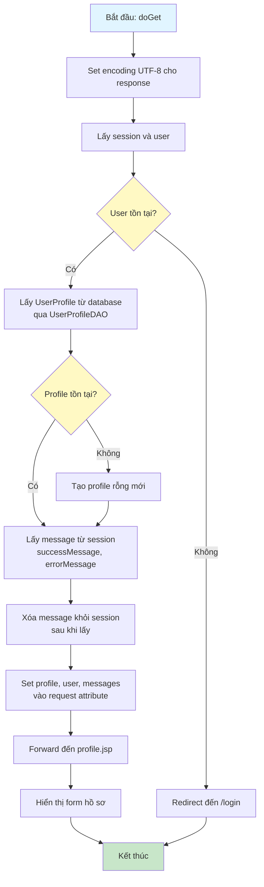
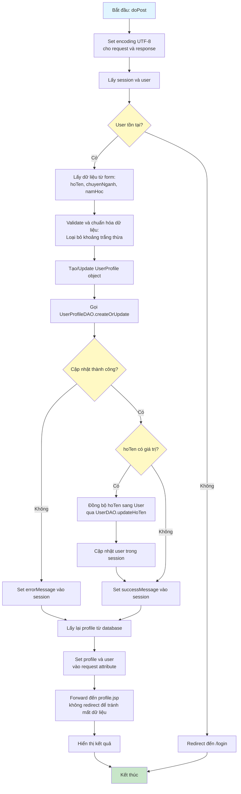

# Sơ Đồ Luồng Hoạt Động - ProfileServlet

## Mô tả
Servlet xử lý hồ sơ cá nhân của người dùng. Hỗ trợ GET để hiển thị form và POST để cập nhật thông tin.

## Sơ Đồ Luồng - Phương Thức doGet

## Sơ Đồ Luồng - Phương Thức doPost

## Chi Tiết Các Bước

### 1. Hiển Thị Form (doGet)
- Kiểm tra đăng nhập
- Lấy UserProfile từ database, nếu chưa có thì tạo profile rỗng
- Lấy và xóa messages từ session (success/error)
- Hiển thị form với dữ liệu hiện tại

### 2. Cập Nhật Hồ Sơ (doPost)
- Validate và chuẩn hóa dữ liệu đầu vào
- Sử dụng `createOrUpdate` để tạo mới hoặc cập nhật profile
- Đồng bộ họ tên từ profile sang bảng users nếu có thay đổi
- Cập nhật user trong session để phản ánh thay đổi ngay lập tức

### 3. Xử Lý Messages
- Sử dụng session để lưu messages (thành công/lỗi)
- Forward thay vì redirect để giữ nguyên dữ liệu form
- Messages được hiển thị và tự động xóa sau khi lấy

### 4. Đồng Bộ Dữ Liệu
- Khi cập nhật họ tên trong profile, đồng bộ sang bảng users
- Đảm bảo dữ liệu nhất quán giữa hai bảng

