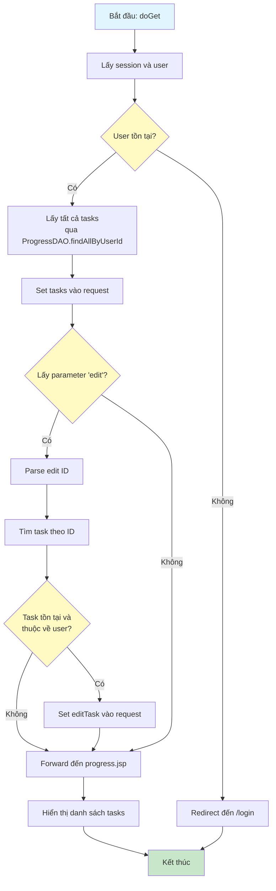
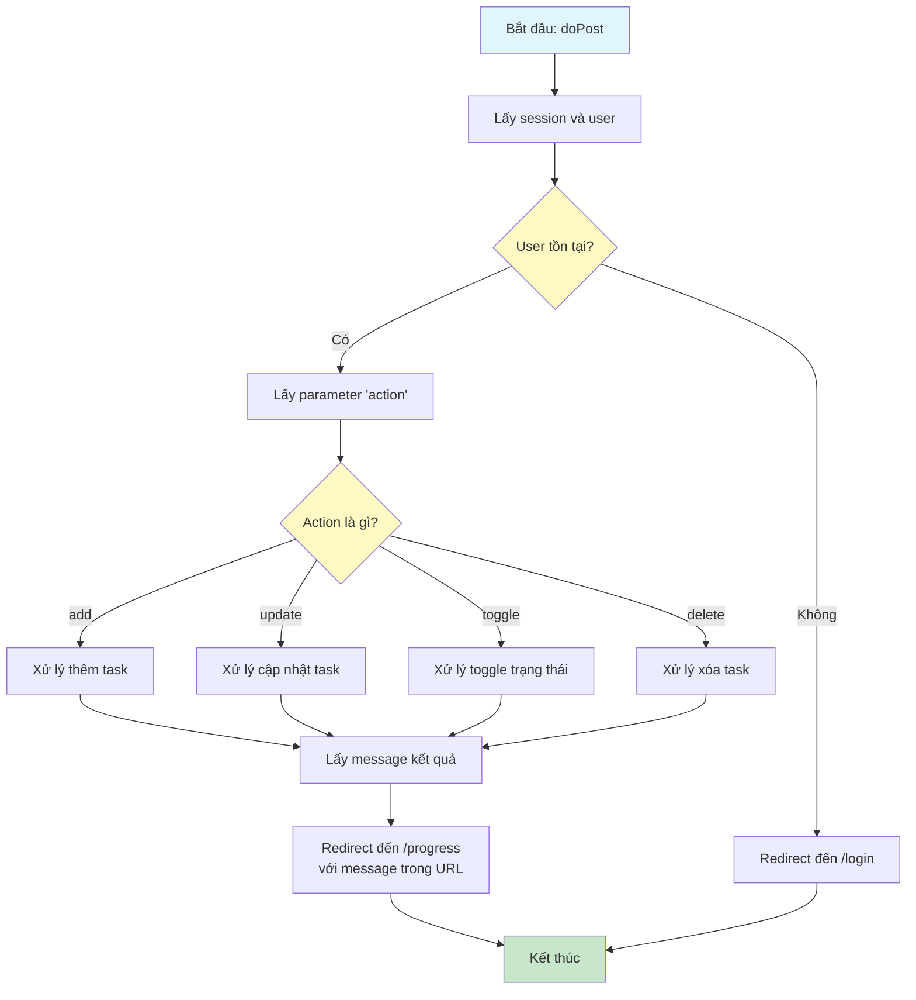
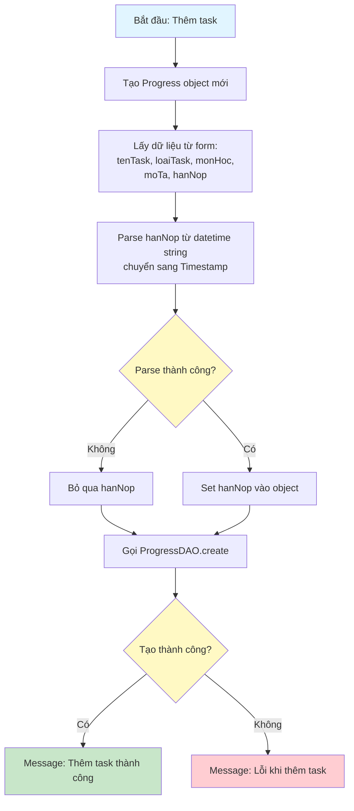
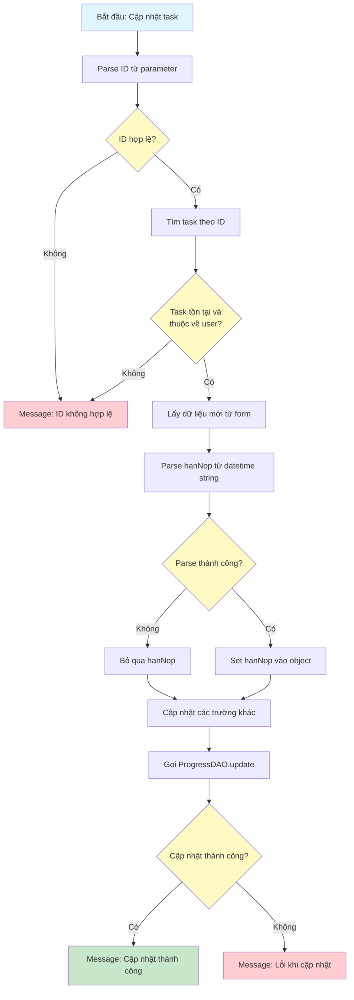
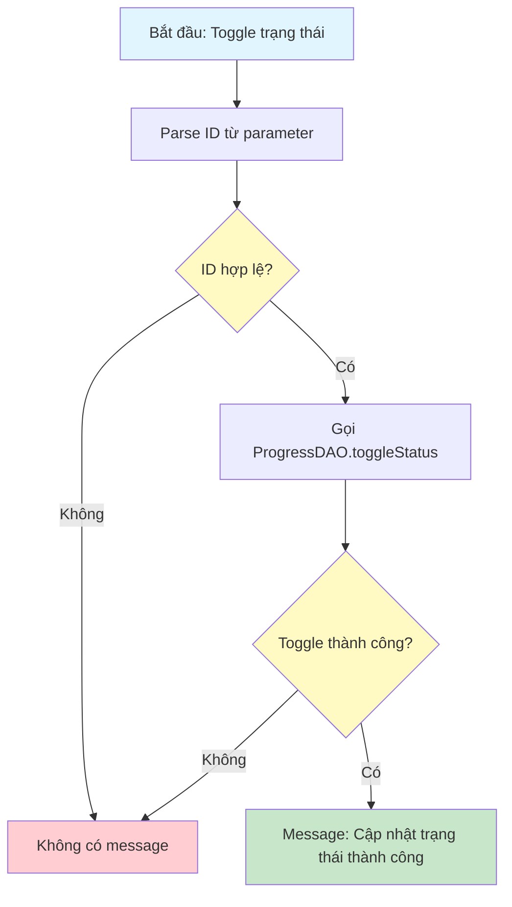
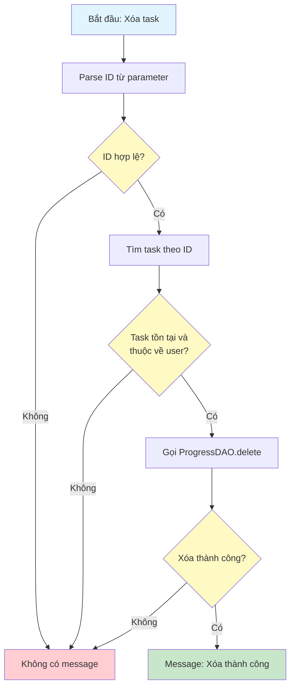

# Sơ Đồ Luồng Hoạt Động - ProgressServlet

## Mô tả
Servlet xử lý quản lý tiến độ học tập (tasks) của người dùng. Hỗ trợ GET để hiển thị danh sách và POST để thêm/sửa/xóa/toggle trạng thái.

## Sơ Đồ Luồng - Phương Thức doGet

## Sơ Đồ Luồng - Phương Thức doPost

## Sơ Đồ Luồng - Xử Lý Thêm Task (action=add)

## Sơ Đồ Luồng - Xử Lý Cập Nhật Task (action=update)

## Sơ Đồ Luồng - Xử Lý Toggle Trạng Thái (action=toggle)

## Sơ Đồ Luồng - Xử Lý Xóa Task (action=delete)

## Chi Tiết Các Bước

### 1. Hiển Thị Danh Sách Tasks (doGet)
- Lấy tất cả tasks của user, sắp xếp theo hạn nộp
- Nếu có parameter `edit`, lấy task tương ứng để hiển thị trong form chỉnh sửa

### 2. Thêm Task
- Tạo Progress object mới với thông tin từ form
- Parse hạn nộp từ datetime string sang Timestamp
- Trạng thái mặc định là "chuaxong"

### 3. Cập Nhật Task
- Kiểm tra task tồn tại và thuộc về user
- Cập nhật các trường thông tin
- Parse lại hạn nộp nếu có

### 4. Toggle Trạng Thái
- Chuyển đổi trạng thái giữa "chuaxong" và "daxong"
- Tự động cập nhật completed_at khi chuyển sang "daxong"

### 5. Xóa Task
- Kiểm tra quyền sở hữu
- Xóa task khỏi database

