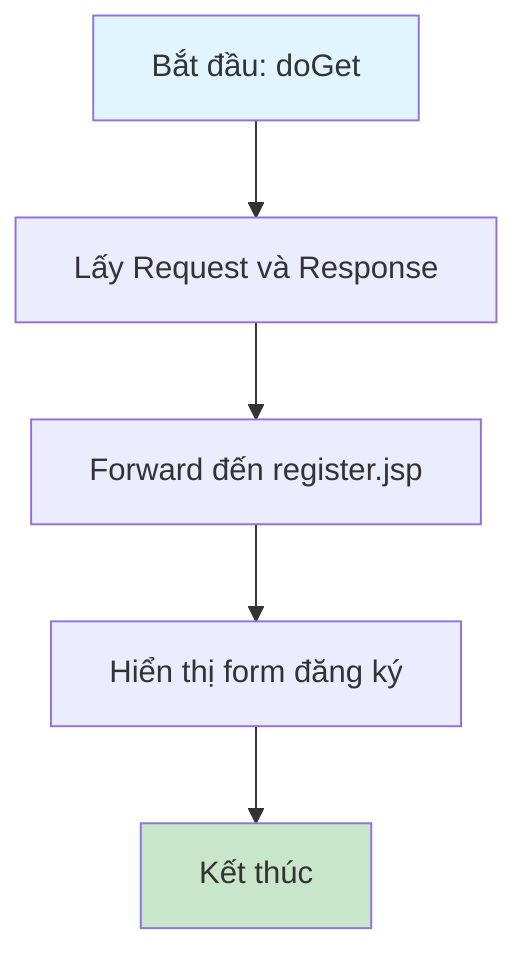
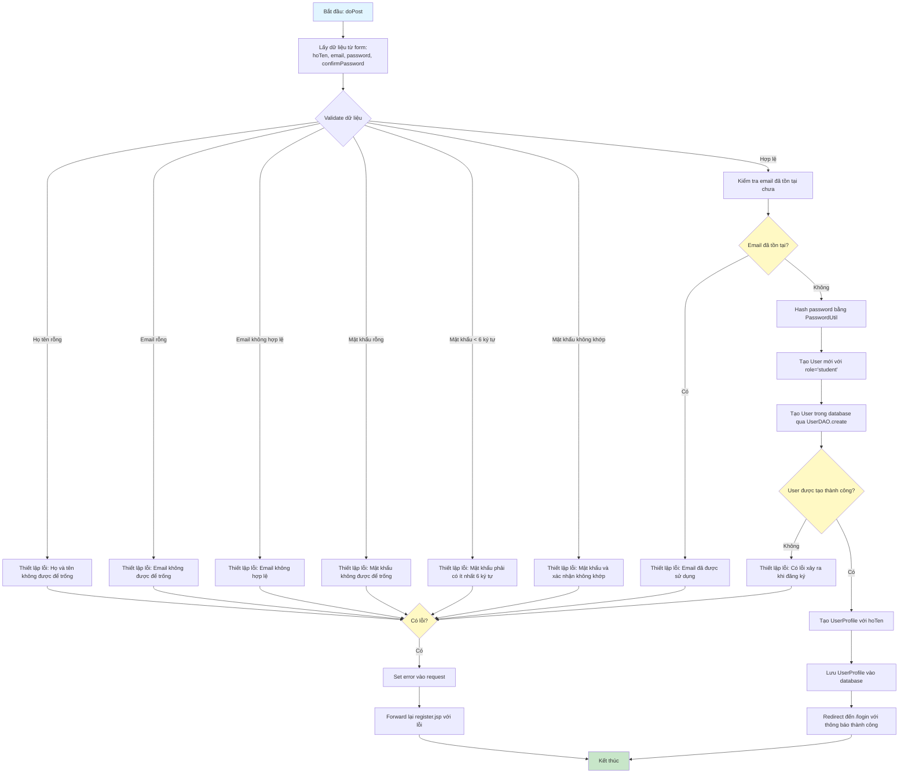

# Sơ Đồ Luồng Hoạt Động - RegisterServlet

## Mô tả
Servlet xử lý đăng ký tài khoản người dùng mới. Hỗ trợ GET để hiển thị form đăng ký và POST để xử lý đăng ký.

## Sơ Đồ Luồng - Phương Thức doGet

## Sơ Đồ Luồng - Phương Thức doPost

## Chi Tiết Các Bước

### 1. Validate Dữ Liệu
- Kiểm tra họ tên không được rỗng
- Kiểm tra email không được rỗng và đúng định dạng
- Kiểm tra mật khẩu không được rỗng, tối thiểu 6 ký tự
- Kiểm tra mật khẩu và xác nhận mật khẩu phải khớp

### 2. Kiểm Tra Email Trùng
- Sử dụng `UserDAO.findByEmail()` để kiểm tra email đã tồn tại

### 3. Tạo Tài Khoản
- Hash mật khẩu bằng `PasswordUtil.hashPassword()`
- Tạo User mới với role mặc định là "student"
- Lưu User vào database
- Tạo UserProfile tương ứng để đồng bộ thông tin

### 4. Kết Quả
- Thành công: Redirect đến trang đăng nhập với thông báo
- Thất bại: Hiển thị lại form với thông báo lỗi

