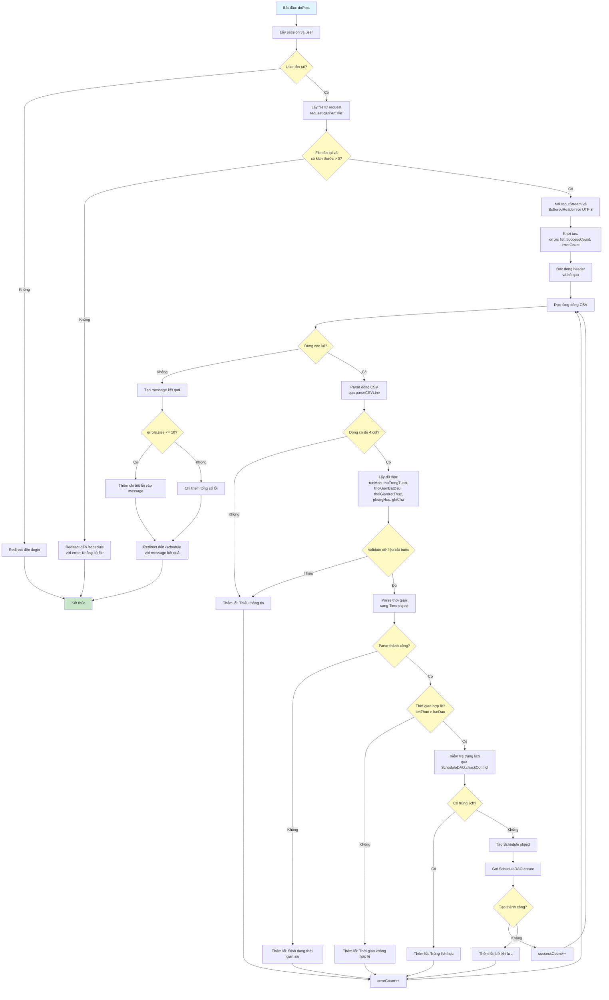

# Sơ Đồ Luồng Hoạt Động - ScheduleImportServlet

## Mô tả
Servlet xử lý import lịch học từ file CSV. Chỉ hỗ trợ POST với multipart/form-data.

## Sơ Đồ Luồng - Phương Thức doPost



## Sơ Đồ Luồng - Phương Thức parseCSVLine

```mermaid
flowchart TD
    A[Bắt đầu: parseCSVLine] --> B[Khởi tạo:<br/>result list, inQuotes flag,<br/>current StringBuilder]
    B --> C[Duyệt từng ký tự trong dòng]
    C --> D{Ký tự là gì?}
    D -->|Dấu nháy kép "| E{inQuotes?}
    E -->|Có| F[Đóng quotes]
    E -->|Không| G[Mở quotes]
    F --> H[Tiếp tục duyệt]
    G --> H
    D -->|Dấu phẩy ,| I{inQuotes?}
    I -->|Có| J[Thêm vào current<br/>không tách cột]
    I -->|Không| K[Kết thúc cột hiện tại<br/>thêm vào result]
    J --> H
    K --> L[Reset current]
    L --> H
    D -->|Ký tự khác| M[Thêm vào current]
    M --> H
    H --> N{Còn ký tự?}
    N -->|Có| C
    N -->|Không| O[Thêm cột cuối cùng vào result]
    O --> P[Trả về mảng String]
    P --> Q[Kết thúc]
    
    style A fill:#e1f5ff
    style Q fill:#c8e6c9
    style D fill:#fff9c4
    style E fill:#fff9c4
    style I fill:#fff9c4
    style N fill:#fff9c4
```

## Chi Tiết Các Bước

### 1. Kiểm Tra File
- Kiểm tra file có tồn tại và có kích thước > 0
- File CSV được đọc với encoding UTF-8

### 2. Parse CSV
- Bỏ qua dòng header
- Đọc từng dòng và parse bằng phương thức `parseCSVLine`
- Hỗ trợ xử lý dấu nháy kép trong CSV (cho phép dấu phẩy trong giá trị)

### 3. Validate Từng Dòng
- Kiểm tra đủ 4 cột bắt buộc (tên môn, thứ, thời gian bắt đầu, thời gian kết thúc)
- Parse thời gian từ string (HH:mm) sang Time object
- Kiểm tra thời gian hợp lệ (kết thúc phải sau bắt đầu)
- Kiểm tra trùng lịch với các lịch đã có

### 4. Lưu Dữ Liệu
- Tạo Schedule object cho mỗi dòng hợp lệ
- Lưu vào database qua ScheduleDAO
- Đếm số dòng thành công và thất bại

### 5. Tổng Hợp Kết Quả
- Tạo message tổng hợp: số dòng thành công, số dòng lỗi
- Nếu có ít hơn 10 lỗi, hiển thị chi tiết từng lỗi
- Nếu có nhiều hơn 10 lỗi, chỉ hiển thị tổng số

### 6. Định Dạng CSV
- Định dạng mong đợi: tenMon, thuTrongTuan, thoiGianBatDau, thoiGianKetThuc, phongHoc, ghiChu
- Hỗ trợ dấu nháy kép để chứa dấu phẩy trong giá trị
- Thời gian định dạng: HH:mm (ví dụ: 08:00, 10:30)

