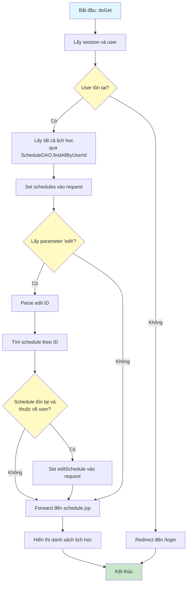
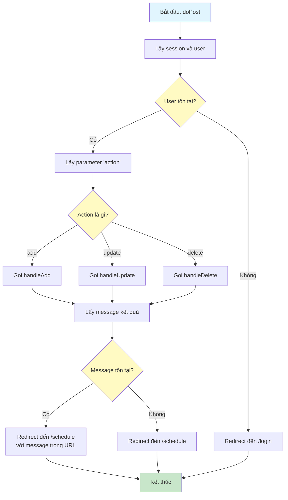
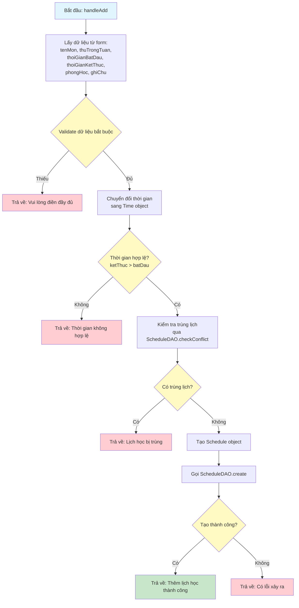
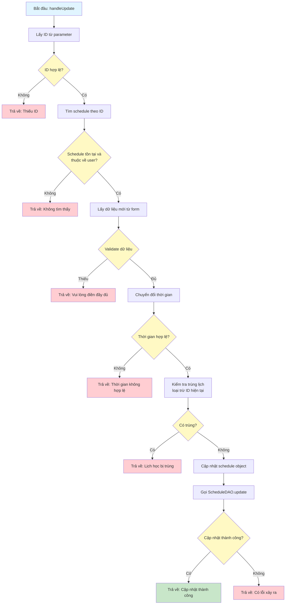
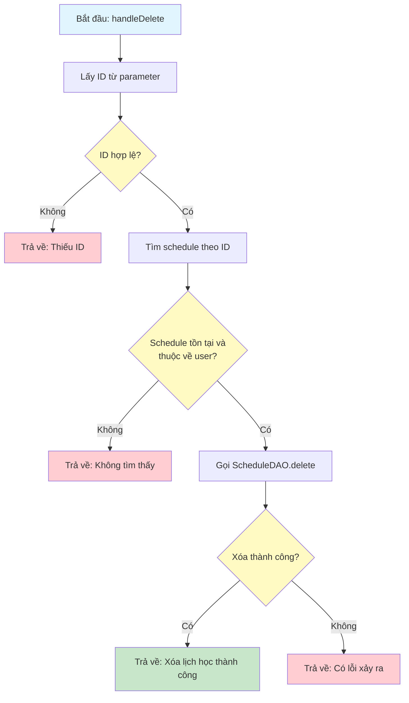

# Sơ Đồ Luồng Hoạt Động - ScheduleServlet

## Mô tả
Servlet xử lý CRUD lịch học của người dùng. Hỗ trợ GET để hiển thị danh sách và POST để thêm/sửa/xóa.

## Sơ Đồ Luồng - Phương Thức doGet

## Sơ Đồ Luồng - Phương Thức doPost

## Sơ Đồ Luồng - Phương Thức handleAdd

## Sơ Đồ Luồng - Phương Thức handleUpdate

## Sơ Đồ Luồng - Phương Thức handleDelete

## Chi Tiết Các Bước

### 1. Hiển Thị Danh Sách (doGet)
- Lấy tất cả lịch học của user, sắp xếp theo thứ và thời gian
- Nếu có parameter `edit`, lấy schedule tương ứng để hiển thị trong form chỉnh sửa

### 2. Thêm Lịch Học (handleAdd)
- Validate dữ liệu bắt buộc
- Kiểm tra thời gian hợp lệ (kết thúc phải sau bắt đầu)
- Kiểm tra trùng lịch với các lịch đã có
- Tạo mới nếu hợp lệ

### 3. Cập Nhật Lịch Học (handleUpdate)
- Kiểm tra schedule tồn tại và thuộc về user
- Validate dữ liệu mới
- Kiểm tra trùng lịch (loại trừ chính nó)
- Cập nhật nếu hợp lệ

### 4. Xóa Lịch Học (handleDelete)
- Kiểm tra schedule tồn tại và thuộc về user
- Xóa khỏi database

### 5. Bảo Mật
- Tất cả các thao tác đều kiểm tra schedule thuộc về user hiện tại
- Ngăn chặn người dùng chỉnh sửa/xóa lịch của người khác

