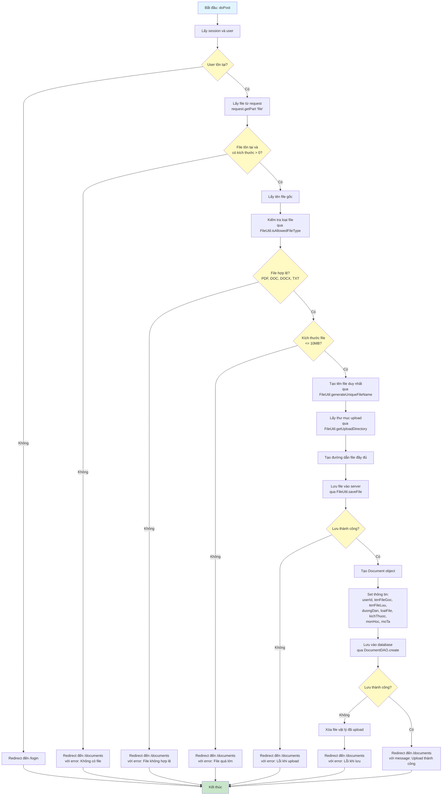

# Sơ Đồ Luồng Hoạt Động - UploadDocumentServlet

## Mô tả
Servlet xử lý upload tài liệu lên server. Chỉ hỗ trợ POST với multipart/form-data.

## Sơ Đồ Luồng - Phương Thức doPost

## Chi Tiết Các Bước

### 1. Kiểm Tra Đăng Nhập
- Xác thực user đã đăng nhập trước khi cho phép upload

### 2. Validate File
- Kiểm tra file có tồn tại và có kích thước > 0
- Kiểm tra loại file chỉ cho phép: PDF, DOC, DOCX, TXT
- Kiểm tra kích thước file tối đa 10MB

### 3. Xử Lý File
- Tạo tên file duy nhất bằng UUID để tránh trùng lặp
- Lấy thư mục upload từ ServletContext
- Lưu file vào thư mục uploads/documents

### 4. Lưu Thông Tin Database
- Tạo Document object với đầy đủ thông tin
- Lưu vào database qua DocumentDAO
- Nếu lưu database thất bại, xóa file vật lý đã upload

### 5. Kết Quả
- Thành công: Redirect với thông báo thành công
- Thất bại: Redirect với thông báo lỗi cụ thể

### 6. Bảo Mật
- Chỉ cho phép upload các loại file an toàn
- Giới hạn kích thước file để tránh tấn công DoS
- Tên file được tạo ngẫu nhiên để tránh truy cập trực tiếp

