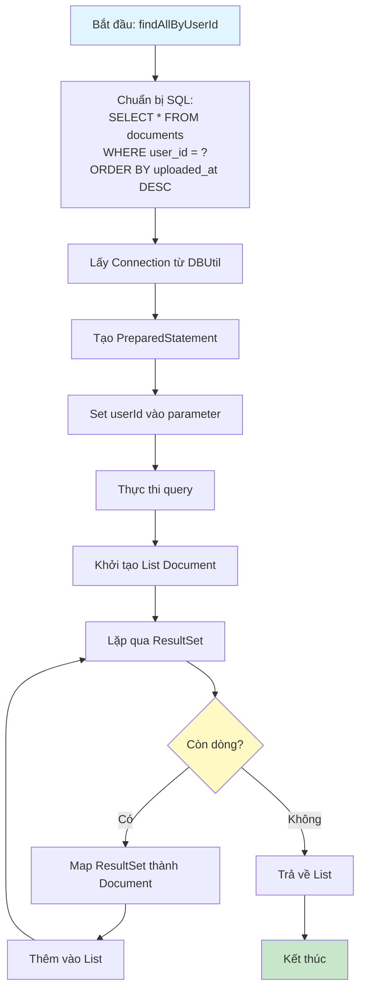
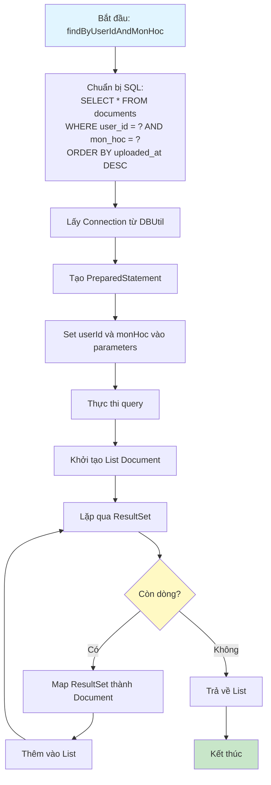
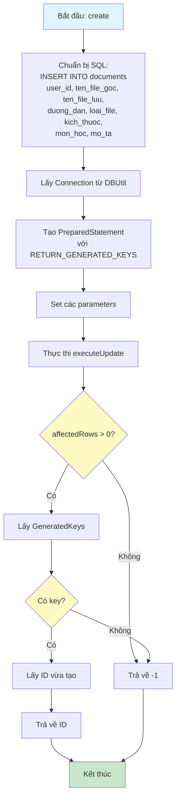
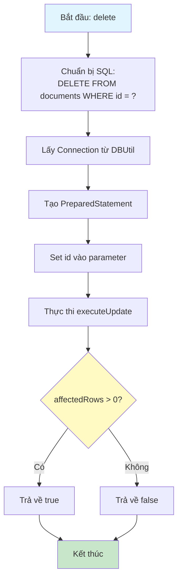

# Sơ Đồ Luồng Hoạt Động - DocumentDAO

## Mô tả
Data Access Object cho bảng documents. Xử lý các thao tác CRUD với database.

## Sơ Đồ Luồng - Phương Thức findAllByUserId

## Sơ Đồ Luồng - Phương Thức findByUserIdAndMonHoc

## Sơ Đồ Luồng - Phương Thức create

## Sơ Đồ Luồng - Phương Thức delete

## Chi Tiết Các Bước

### 1. Lấy Danh Sách Tài Liệu
- `findAllByUserId`: Lấy tất cả tài liệu của user
- `findByUserIdAndMonHoc`: Lọc theo môn học
- Sắp xếp theo thời gian upload (mới nhất trước)

### 2. Lưu Thông Tin File
- Lưu cả tên file gốc (ten_file_goc) và tên file lưu (ten_file_luu)
- Tên file lưu là UUID để tránh trùng lặp
- Lưu đường dẫn đầy đủ (duong_dan) để truy cập file
- Lưu loại file (loai_file) và kích thước (kich_thuoc)

### 3. Xóa Tài Liệu
- Chỉ xóa bản ghi trong database
- File vật lý phải được xóa riêng ở controller

### 4. Mapping Dữ Liệu
- Map từ ResultSet sang Document object
- Xử lý các trường có thể null (monHoc, moTa)

### 5. Lưu Ý
- DocumentDAO chỉ quản lý metadata của file
- File vật lý được lưu trong thư mục uploads/documents
- Cần đồng bộ giữa database và file system khi xóa

