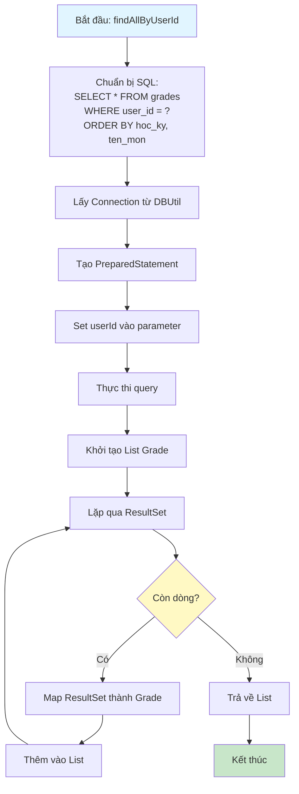
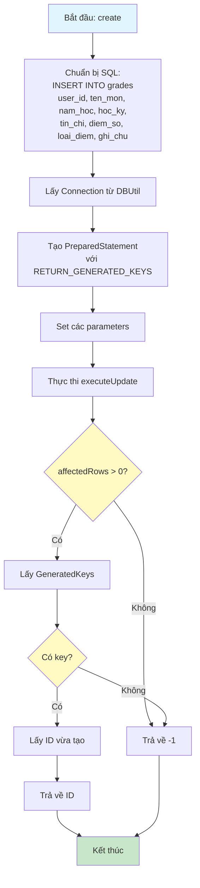
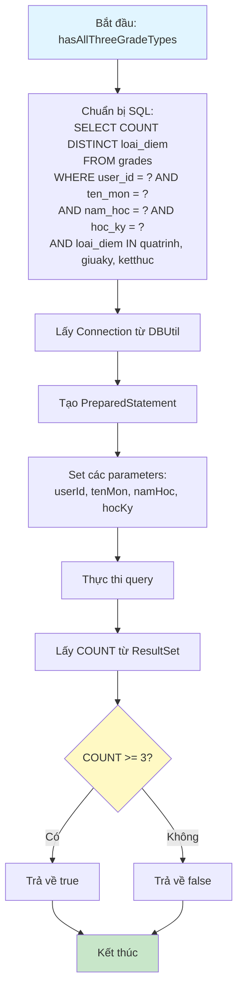
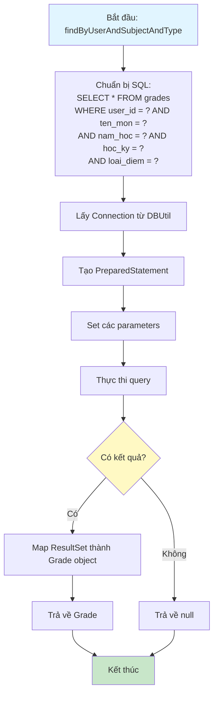
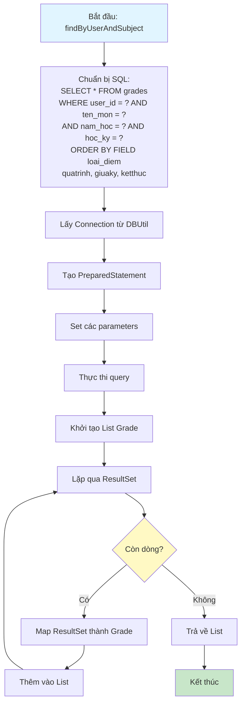

# Sơ Đồ Luồng Hoạt Động - GradeDAO

## Mô tả
Data Access Object cho bảng grades. Xử lý các thao tác CRUD với database và các truy vấn đặc biệt.

## Sơ Đồ Luồng - Phương Thức findAllByUserId

## Sơ Đồ Luồng - Phương Thức create

## Sơ Đồ Luồng - Phương Thức hasAllThreeGradeTypes

## Sơ Đồ Luồng - Phương Thức findByUserAndSubjectAndType

## Sơ Đồ Luồng - Phương Thức findByUserAndSubject

## Chi Tiết Các Bước

### 1. Quản Lý Điểm Số
- Lưu trữ nhiều loại điểm cho mỗi môn học:
  - quatrinh: Điểm quá trình (20%)
  - giuaky: Điểm giữa kỳ (30%)
  - ketthuc: Điểm kết thúc (50%)
  - tongket: Điểm tổng kết (tự động tính)

### 2. Kiểm Tra Đủ 3 Loại Điểm
- Sử dụng `hasAllThreeGradeTypes` để kiểm tra môn học đã có đủ 3 loại điểm chưa
- Điều kiện: cùng user_id, ten_mon, nam_hoc, hoc_ky
- Phải có cả 3 loại: quatrinh, giuaky, ketthuc

### 3. Tìm Điểm Theo Loại
- `findByUserAndSubjectAndType`: Tìm điểm cụ thể theo loại
- Sử dụng để lấy từng loại điểm khi tính điểm tổng kết

### 4. Lấy Tất Cả Điểm Của Môn Học
- `findByUserAndSubject`: Lấy tất cả điểm của một môn học
- Sắp xếp theo thứ tự: quatrinh, giuaky, ketthuc
- Sử dụng FIELD() trong SQL để sắp xếp theo thứ tự tùy chỉnh

### 5. Xử Lý NULL
- Hỗ trợ nam_hoc có thể NULL
- Sử dụng điều kiện: `(nam_hoc = ? OR (nam_hoc IS NULL AND ? IS NULL))`

