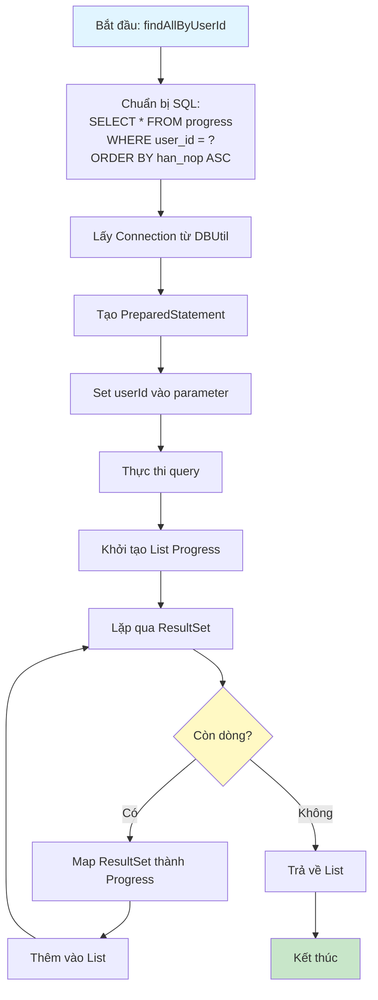
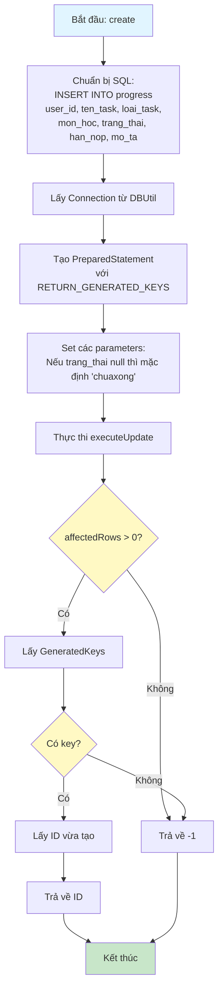
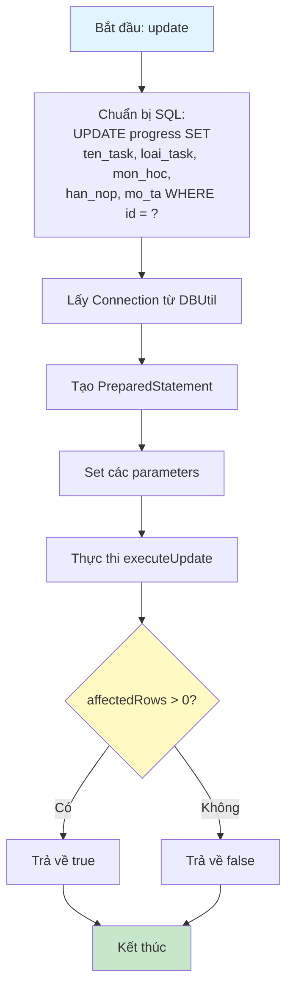

# Sơ Đồ Luồng Hoạt Động - ProgressDAO

## Mô tả
Data Access Object cho bảng progress. Xử lý các thao tác CRUD với database và toggle trạng thái.

## Sơ Đồ Luồng - Phương Thức findAllByUserId



## Sơ Đồ Luồng - Phương Thức create



## Sơ Đồ Luồng - Phương Thức toggleStatus

```mermaid
flowchart TD
    A[Bắt đầu: toggleStatus] --> B[Chuẩn bị SQL:<br/>UPDATE progress SET<br/>trang_thai = CASE<br/>WHEN trang_thai='chuaxong'<br/>THEN 'daxong'<br/>ELSE 'chuaxong' END,<br/>completed_at = CASE<br/>WHEN trang_thai='chuaxong'<br/>THEN NOW()<br/>ELSE NULL END<br/>WHERE id = ?]
    B --> C[Lấy Connection từ DBUtil]
    C --> D[Tạo PreparedStatement]
    D --> E[Set id vào parameter]
    E --> F[Thực thi executeUpdate]
    F --> G{affectedRows > 0?}
    G -->|Có| H[Trả về true]
    G -->|Không| I[Trả về false]
    H --> J[Kết thúc]
    I --> J
    
    style A fill:#e1f5ff
    style J fill:#c8e6c9
    style G fill:#fff9c4
```

## Sơ Đồ Luồng - Phương Thức update



## Chi Tiết Các Bước

### 1. Sắp Xếp Tasks
- Sắp xếp theo hạn nộp (han_nop) tăng dần
- Giúp hiển thị các task sắp đến hạn trước

### 2. Trạng Thái Mặc Định
- Khi tạo task mới, trạng thái mặc định là "chuaxong"
- Có thể set trạng thái khác nếu cần

### 3. Toggle Trạng Thái
- Chuyển đổi giữa "chuaxong" và "daxong"
- Khi chuyển sang "daxong", tự động set completed_at = NOW()
- Khi chuyển về "chuaxong", set completed_at = NULL
- Sử dụng CASE statement trong SQL để thực hiện trong một query

### 4. Cập Nhật Task
- Cập nhật các trường: tenTask, loaiTask, monHoc, hanNop, moTa
- Không cập nhật trang_thai (phải dùng toggleStatus)

### 5. Mapping Dữ Liệu
- Map từ ResultSet sang Progress object
- Xử lý các trường có thể null (hanNop, moTa, completedAt)

