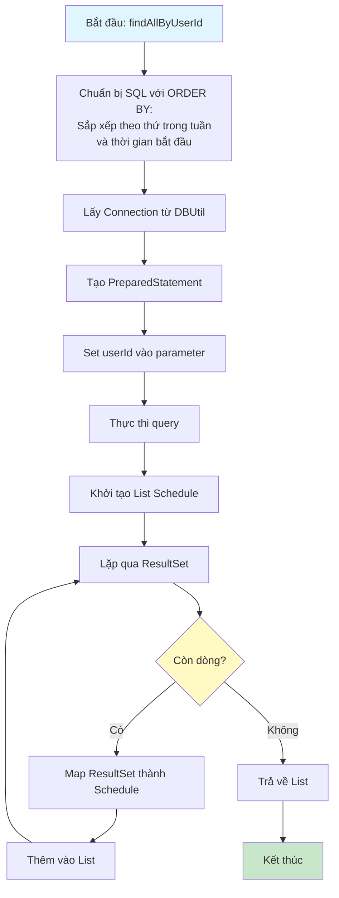
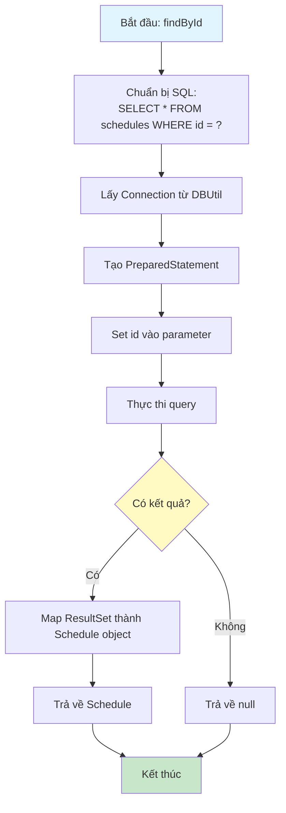
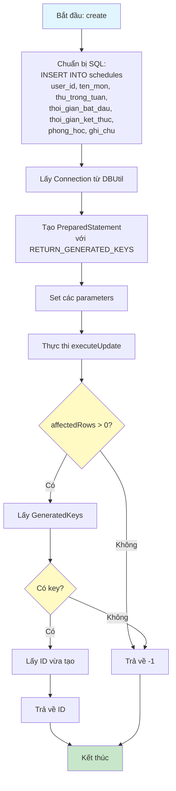
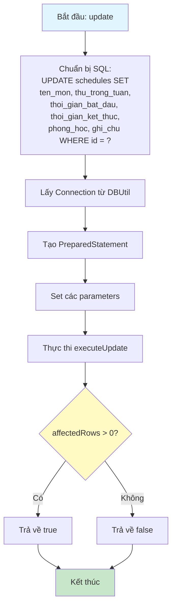
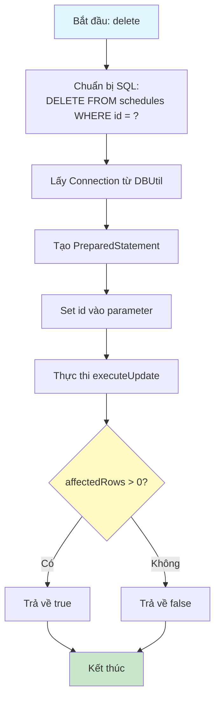

# Sơ Đồ Luồng Hoạt Động - ScheduleDAO

## Mô tả
Data Access Object cho bảng schedules. Xử lý các thao tác CRUD với database và kiểm tra trùng lịch.

## Sơ Đồ Luồng - Phương Thức findAllByUserId



## Sơ Đồ Luồng - Phương Thức findById



## Sơ Đồ Luồng - Phương Thức create



## Sơ Đồ Luồng - Phương Thức update



## Sơ Đồ Luồng - Phương Thức delete



## Sơ Đồ Luồng - Phương Thức checkConflict

```mermaid
flowchart TD
    A[Bắt đầu: checkConflict] --> B[Chuẩn bị SQL:<br/>SELECT COUNT(*) FROM schedules<br/>WHERE user_id = ? AND thu_trong_tuan = ?<br/>AND kiểm tra trùng thời gian]
    B --> C{excludeId > 0?}
    C -->|Có| D[Thêm điều kiện: AND id != ?]
    C -->|Không| E[Lấy Connection từ DBUtil]
    D --> E
    E --> F[Tạo PreparedStatement]
    F --> G[Set các parameters:<br/>userId, thu, batDau, ketThuc, excludeId]
    G --> H[Thực thi query]
    H --> I[Lấy COUNT từ ResultSet]
    I --> J{COUNT > 0?}
    J -->|Có| K[Trả về true - Có trùng]
    J -->|Không| L[Trả về false - Không trùng]
    K --> M[Kết thúc]
    L --> M
    
    style A fill:#e1f5ff
    style M fill:#c8e6c9
    style C fill:#fff9c4
    style J fill:#fff9c4
```

## Chi Tiết Các Bước

### 1. Sắp Xếp Lịch Học
- Sắp xếp theo thứ trong tuần (Thứ 2 -> Chủ nhật)
- Sau đó sắp xếp theo thời gian bắt đầu
- Sử dụng CASE statement trong SQL để sắp xếp thứ

### 2. Kiểm Tra Trùng Lịch
- Kiểm tra xem có lịch học nào trùng thời gian không
- Điều kiện trùng:
  - Cùng user_id
  - Cùng thứ trong tuần
  - Thời gian bị chồng chéo (một trong các trường hợp):
    - Lịch mới bắt đầu trong khoảng lịch cũ
    - Lịch mới kết thúc trong khoảng lịch cũ
    - Lịch mới bao trùm lịch cũ hoàn toàn
- Hỗ trợ excludeId để loại trừ chính nó khi update

### 3. Xử Lý Thời Gian
- Sử dụng Time object để lưu thời gian bắt đầu và kết thúc
- So sánh thời gian trong SQL để kiểm tra trùng

### 4. Mapping Dữ Liệu
- Map từ ResultSet sang Schedule object
- Xử lý các trường có thể null (phongHoc, ghiChu)

