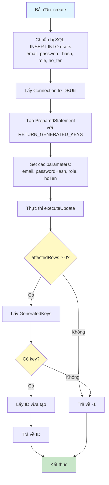
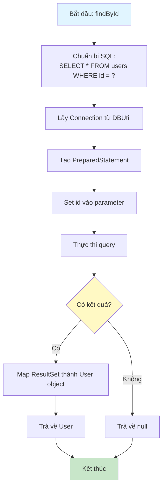
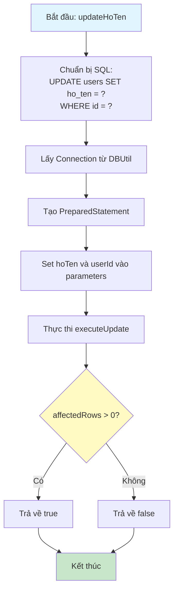
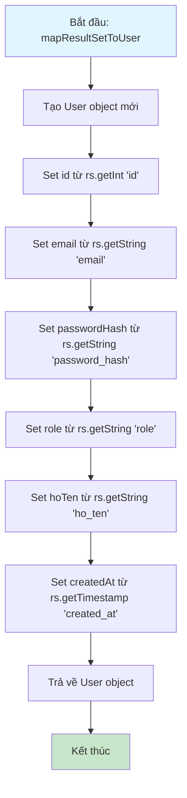

# Sơ Đồ Luồng Hoạt Động - UserDAO

## Mô tả
Data Access Object cho bảng users. Xử lý các thao tác CRUD với database.

## Sơ Đồ Luồng - Phương Thức findByEmail

## Sơ Đồ Luồng - Phương Thức create

## Sơ Đồ Luồng - Phương Thức findById

## Sơ Đồ Luồng - Phương Thức updateHoTen

## Sơ Đồ Luồng - Phương Thức mapResultSetToUser

## Chi Tiết Các Bước

### 1. Kết Nối Database
- Sử dụng `DBUtil.getConnection()` để lấy connection
- Tự động đóng connection và statement khi kết thúc (try-with-resources)

### 2. PreparedStatement
- Sử dụng PreparedStatement để tránh SQL injection
- Set parameters an toàn trước khi thực thi

### 3. Xử Lý Kết Quả
- Sử dụng ResultSet để đọc dữ liệu từ database
- Map ResultSet thành User object qua phương thức `mapResultSetToUser`

### 4. Xử Lý Lỗi
- Bắt SQLException và in ra console
- Trả về giá trị mặc định (null, -1, false) khi có lỗi

### 5. Generated Keys
- Khi tạo user mới, sử dụng `RETURN_GENERATED_KEYS` để lấy ID tự động tạo
- Trả về ID vừa tạo để sử dụng cho các thao tác tiếp theo

