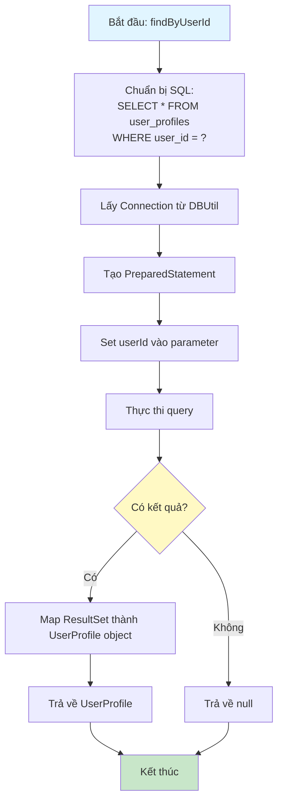
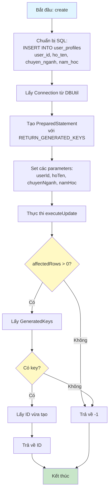
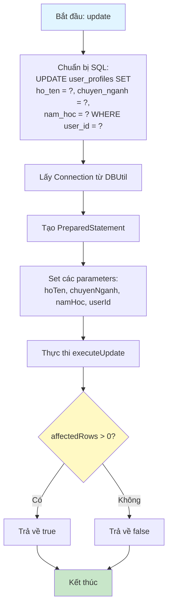
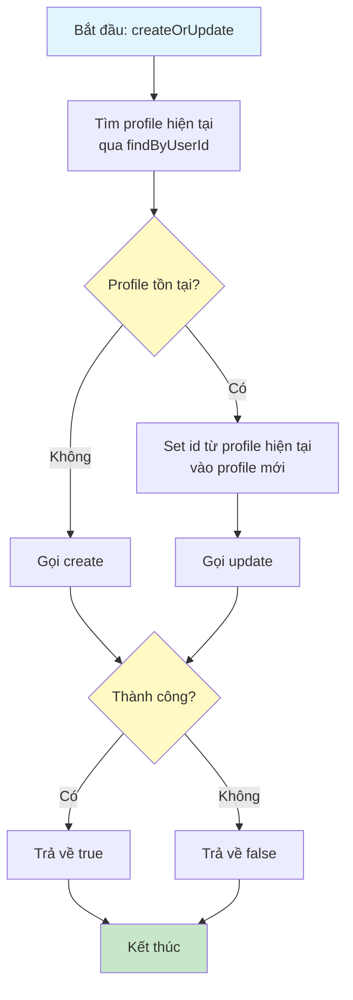
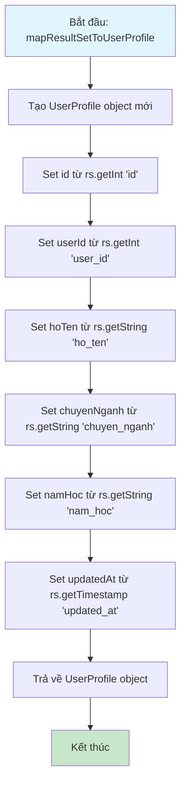

# Sơ Đồ Luồng Hoạt Động - UserProfileDAO

## Mô tả
Data Access Object cho bảng user_profiles. Xử lý các thao tác CRUD với database.

## Sơ Đồ Luồng - Phương Thức findByUserId

## Sơ Đồ Luồng - Phương Thức create

## Sơ Đồ Luồng - Phương Thức update

## Sơ Đồ Luồng - Phương Thức createOrUpdate

## Sơ Đồ Luồng - Phương Thức mapResultSetToUserProfile

## Chi Tiết Các Bước

### 1. Tìm Profile Theo User ID
- Mỗi user chỉ có một profile duy nhất
- Sử dụng `user_id` làm khóa tìm kiếm

### 2. Tạo Mới Profile
- Insert vào database với đầy đủ thông tin
- Trả về ID vừa tạo để sử dụng sau này

### 3. Cập Nhật Profile
- Update các trường: hoTen, chuyenNganh, namHoc
- Sử dụng `user_id` làm điều kiện WHERE

### 4. Create Or Update
- Kiểm tra profile đã tồn tại chưa
- Nếu chưa có thì tạo mới, nếu có rồi thì cập nhật
- Đảm bảo mỗi user chỉ có một profile

### 5. Mapping Dữ Liệu
- Map từ ResultSet sang UserProfile object
- Xử lý các trường có thể null (chuyenNganh, namHoc)

