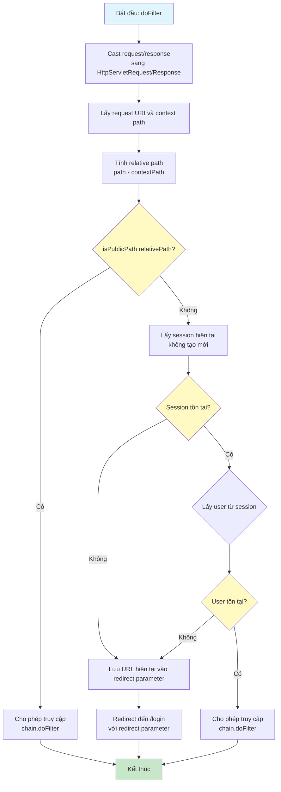
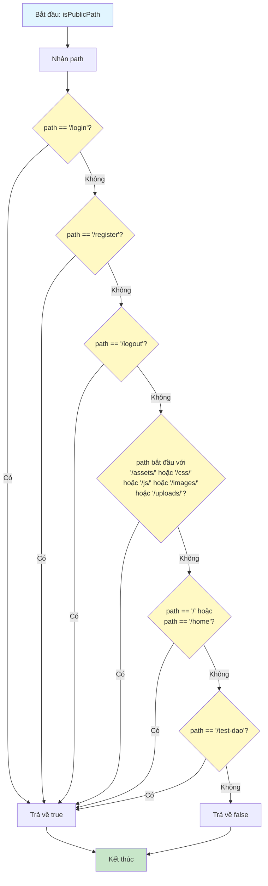
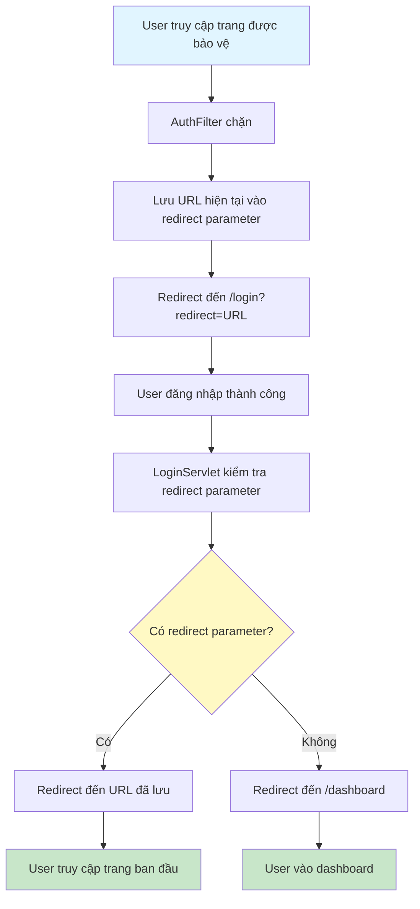

# Sơ Đồ Luồng Hoạt Động - AuthFilter

## Mô tả
Filter để bảo vệ các trang cần đăng nhập. Cho phép truy cập /login, /register, /logout và các file tĩnh. Các trang khác yêu cầu đăng nhập.

## Sơ Đồ Luồng - Phương Thức doFilter

## Sơ Đồ Luồng - Phương Thức isPublicPath

## Sơ Đồ Luồng - Xử Lý Redirect Sau Đăng Nhập

## Chi Tiết Các Bước

### 1. Kiểm Tra Public Path
- Các path không cần đăng nhập:
  - /login, /register, /logout
  - /, /home
  - /assets/, /css/, /js/, /images/, /uploads/
  - /test-dao (có thể xóa sau)

### 2. Kiểm Tra Session
- Lấy session hiện tại mà không tạo mới (getSession(false))
- Nếu không có session, redirect đến login

### 3. Kiểm Tra User
- Lấy user từ session attribute "user"
- Nếu không có user, redirect đến login

### 4. Lưu Redirect URL
- Khi redirect đến login, lưu URL hiện tại vào parameter "redirect"
- LoginServlet sẽ redirect lại sau khi đăng nhập thành công

### 5. Cho Phép Truy Cập
- Nếu đã đăng nhập, gọi chain.doFilter() để tiếp tục
- Request được chuyển đến servlet hoặc resource tiếp theo

### 6. WebFilter Annotation
- @WebFilter("/*") áp dụng cho tất cả requests
- Filter được thực thi trước servlet

