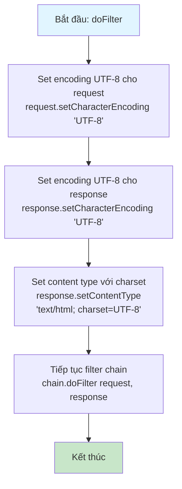
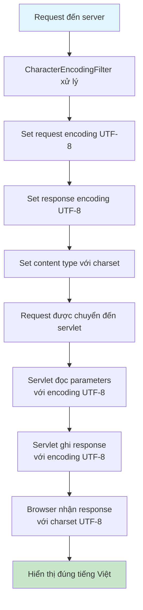

# Sơ Đồ Luồng Hoạt Động - CharacterEncodingFilter

## Mô tả
Filter để xử lý encoding UTF-8 cho request và response. Đảm bảo dữ liệu tiếng Việt được xử lý đúng.

## Sơ Đồ Luồng - Phương Thức doFilter

## Sơ Đồ Luồng - Xử Lý Encoding

## Chi Tiết Các Bước

### 1. Set Request Encoding
- `request.setCharacterEncoding("UTF-8")`
- Phải được gọi trước khi đọc parameters
- Đảm bảo parameters được decode đúng UTF-8

### 2. Set Response Encoding
- `response.setCharacterEncoding("UTF-8")`
- Đảm bảo response được encode đúng UTF-8

### 3. Set Content Type
- `response.setContentType("text/html; charset=UTF-8")`
- Thông báo cho browser về encoding
- Browser sẽ hiển thị đúng tiếng Việt

### 4. Filter Chain
- Gọi `chain.doFilter()` để tiếp tục xử lý
- Filter này phải được thực thi trước các filter/servlet khác

### 5. WebFilter Annotation
- @WebFilter("/*") áp dụng cho tất cả requests
- Đảm bảo mọi request/response đều dùng UTF-8

### 6. Lưu Ý
- Phải set encoding trước khi đọc request parameters
- Phải set encoding trước khi ghi response
- Filter này nên được thực thi đầu tiên trong filter chain

