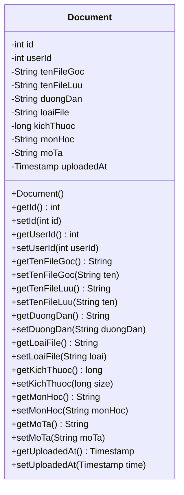
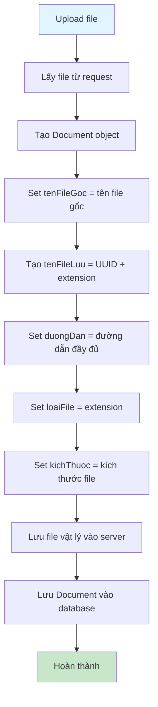
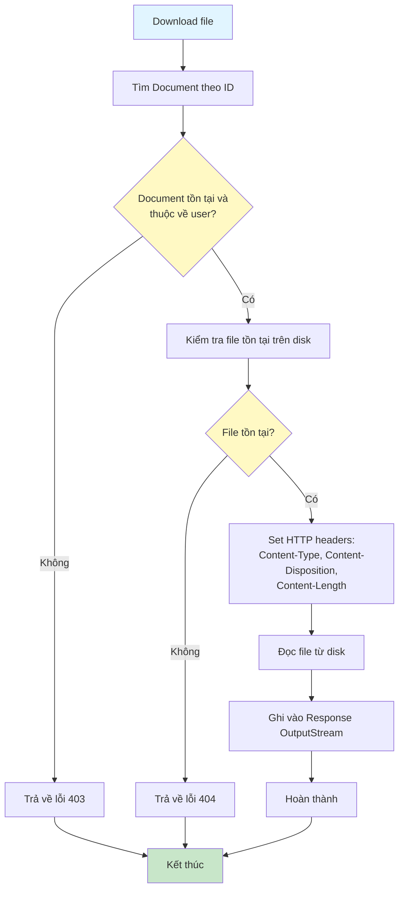

# Sơ Đồ Luồng Hoạt Động - Document Model

## Mô tả
Model class đại diện cho bảng documents. Lưu trữ thông tin tài liệu của sinh viên.

## Cấu Trúc Dữ Liệu

## Sơ Đồ Luồng - Upload File

## Chi Tiết Các Trường

### 1. id (int)
- ID tự động tăng của document
- Được tạo bởi database khi insert

### 2. userId (int)
- ID của user sở hữu document này
- Foreign key tham chiếu đến users.id

### 3. tenFileGoc (String)
- Tên file gốc khi upload
- Giữ nguyên để hiển thị cho user
- Bắt buộc, không được rỗng

### 4. tenFileLuu (String)
- Tên file khi lưu trên server
- Sử dụng UUID để tránh trùng lặp
- Bắt buộc, không được rỗng

### 5. duongDan (String)
- Đường dẫn đầy đủ đến file trên server
- Ví dụ: /uploads/documents/uuid.pdf
- Bắt buộc, không được rỗng

### 6. loaiFile (String)
- Loại file (extension): pdf, doc, docx, txt
- Bắt buộc, không được rỗng

### 7. kichThuoc (long)
- Kích thước file tính bằng bytes
- Bắt buộc, phải > 0

### 8. monHoc (String)
- Môn học liên quan đến document
- Tùy chọn, có thể null

### 9. moTa (String)
- Mô tả về document
- Tùy chọn, có thể null

### 10. uploadedAt (Timestamp)
- Thời gian upload file
- Được set tự động bởi database

## Sơ Đồ Luồng - Download File

## Loại File Hỗ Trợ

- PDF (.pdf)
- Word (.doc, .docx)
- Text (.txt)

## Lưu Ý

- File vật lý được lưu trong thư mục uploads/documents
- Tên file lưu sử dụng UUID để tránh trùng lặp và bảo mật
- Khi xóa document, phải xóa cả file vật lý và bản ghi database

