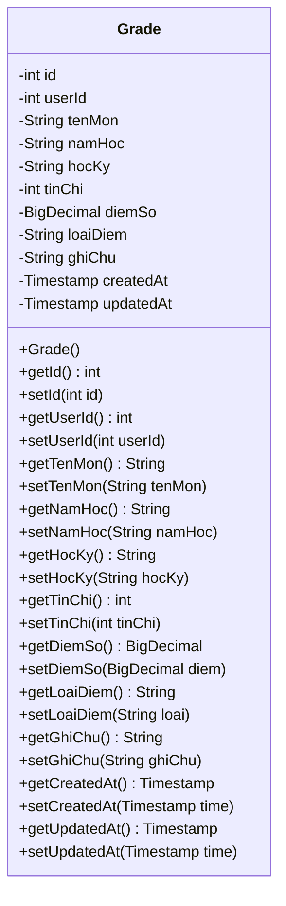
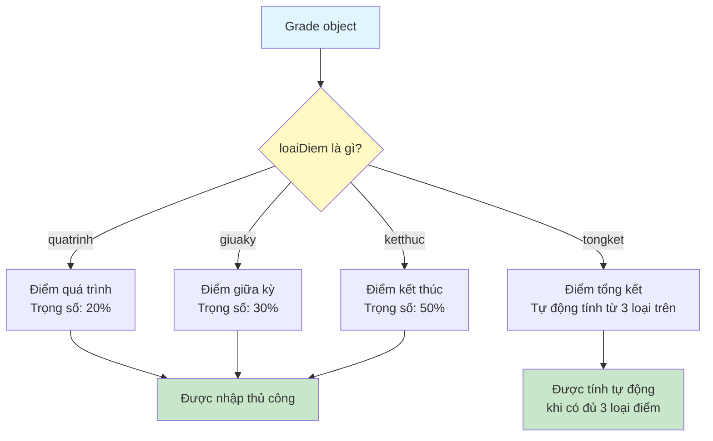
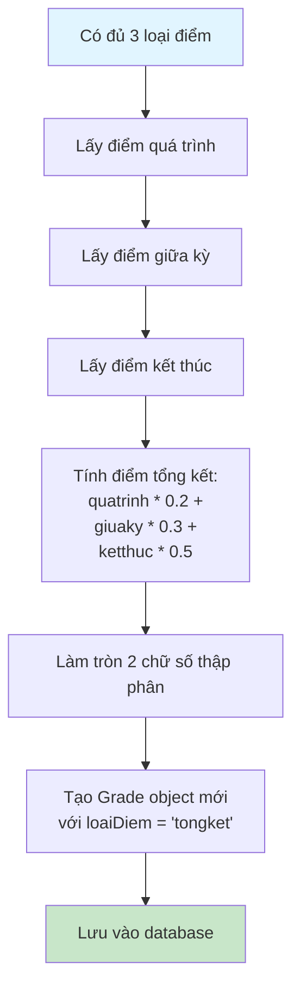

# Sơ Đồ Luồng Hoạt Động - Grade Model

## Mô tả
Model class đại diện cho bảng grades. Lưu trữ điểm số của sinh viên.

## Cấu Trúc Dữ Liệu

## Sơ Đồ Luồng - Các Loại Điểm

## Chi Tiết Các Trường

### 1. id (int)
- ID tự động tăng của điểm
- Được tạo bởi database khi insert

### 2. userId (int)
- ID của user sở hữu điểm này
- Foreign key tham chiếu đến users.id

### 3. tenMon (String)
- Tên môn học
- Bắt buộc, không được rỗng

### 4. namHoc (String)
- Năm học (ví dụ: 2023-2024)
- Có thể null

### 5. hocKy (String)
- Học kỳ (ví dụ: Học kỳ 1, Học kỳ 2)
- Bắt buộc, không được rỗng

### 6. tinChi (int)
- Số tín chỉ của môn học
- Bắt buộc, phải > 0

### 7. diemSo (BigDecimal)
- Điểm số (thang điểm 10)
- Bắt buộc, không được null
- Sử dụng BigDecimal để đảm bảo độ chính xác

### 8. loaiDiem (String)
- Loại điểm: quatrinh, giuaky, ketthuc, tongket
- Bắt buộc, không được rỗng

### 9. ghiChu (String)
- Ghi chú về điểm
- Tùy chọn, có thể null

### 10. createdAt (Timestamp)
- Thời gian tạo điểm
- Được set tự động bởi database

### 11. updatedAt (Timestamp)
- Thời gian cập nhật điểm lần cuối
- Được set tự động bởi database khi update

## Tính Điểm Tổng Kết

