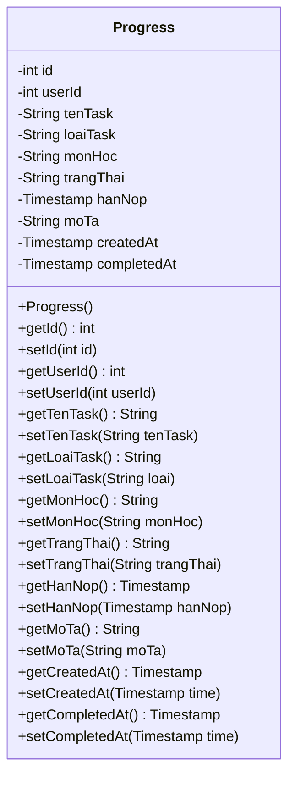
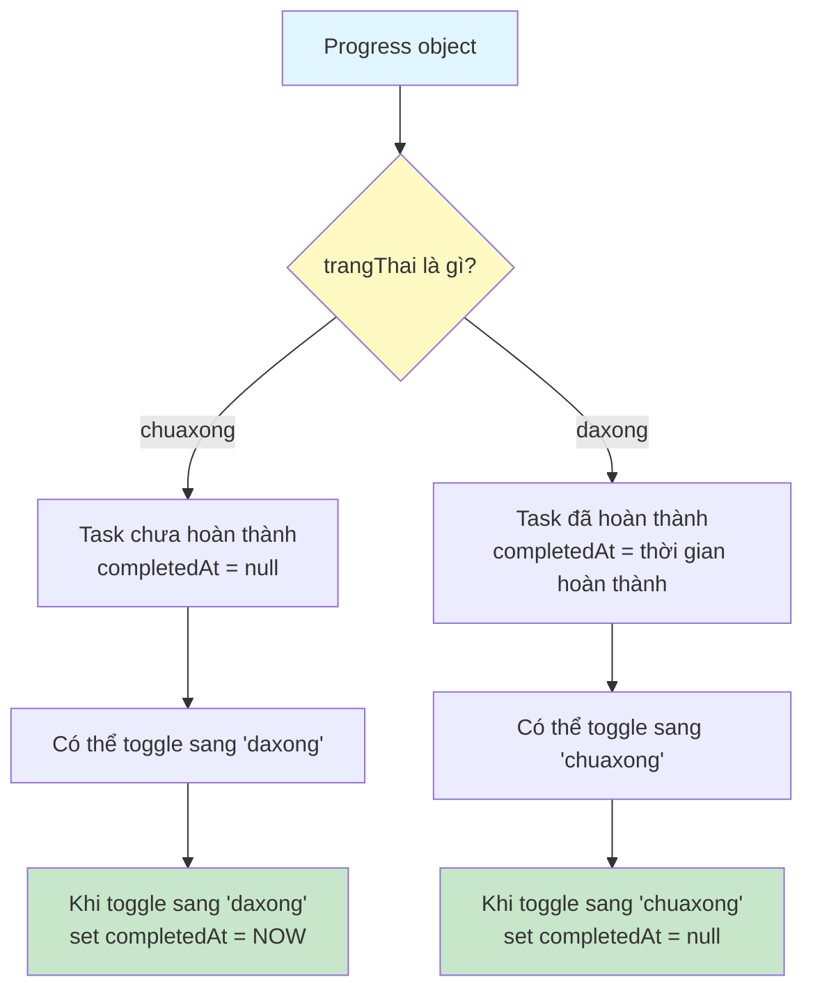
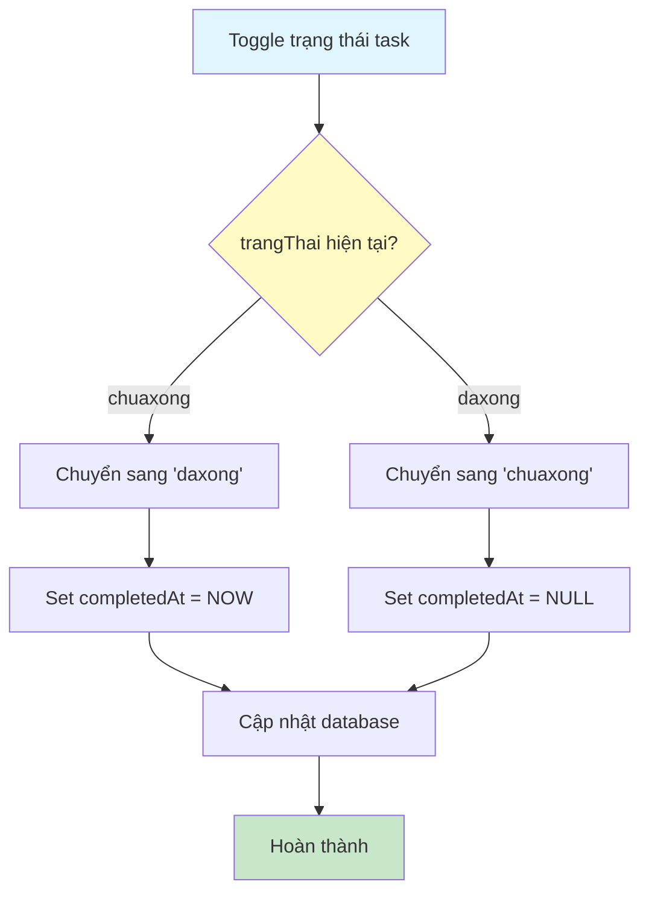

# Sơ Đồ Luồng Hoạt Động - Progress Model

## Mô tả
Model class đại diện cho bảng progress. Lưu trữ tiến độ học tập (các task) của sinh viên.

## Cấu Trúc Dữ Liệu

## Sơ Đồ Luồng - Trạng Thái Task

## Chi Tiết Các Trường

### 1. id (int)
- ID tự động tăng của task
- Được tạo bởi database khi insert

### 2. userId (int)
- ID của user sở hữu task này
- Foreign key tham chiếu đến users.id

### 3. tenTask (String)
- Tên của task
- Bắt buộc, không được rỗng

### 4. loaiTask (String)
- Loại task (ví dụ: Bài tập, Đồ án, Báo cáo)
- Có thể null

### 5. monHoc (String)
- Môn học liên quan đến task
- Có thể null

### 6. trangThai (String)
- Trạng thái task: "chuaxong" hoặc "daxong"
- Mặc định là "chuaxong" khi tạo mới

### 7. hanNop (Timestamp)
- Hạn nộp của task
- Tùy chọn, có thể null
- Định dạng: yyyy-MM-dd HH:mm:ss

### 8. moTa (String)
- Mô tả chi tiết về task
- Tùy chọn, có thể null

### 9. createdAt (Timestamp)
- Thời gian tạo task
- Được set tự động bởi database

### 10. completedAt (Timestamp)
- Thời gian hoàn thành task
- Được set tự động khi trangThai chuyển sang "daxong"
- Null khi trangThai là "chuaxong"

## Sơ Đồ Luồng - Toggle Trạng Thái

