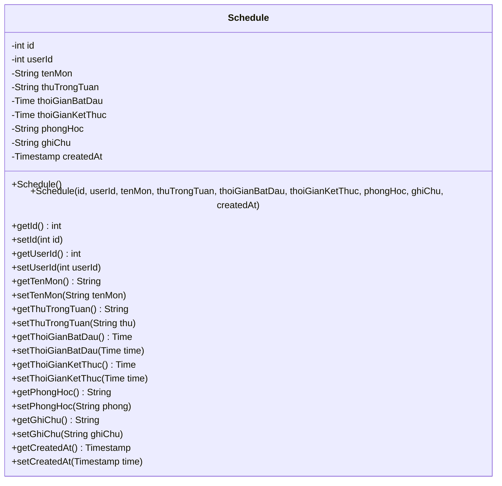
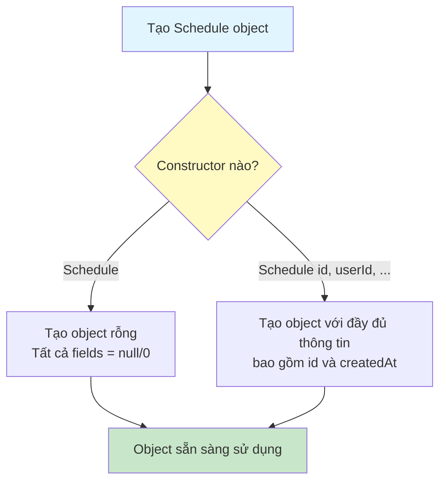
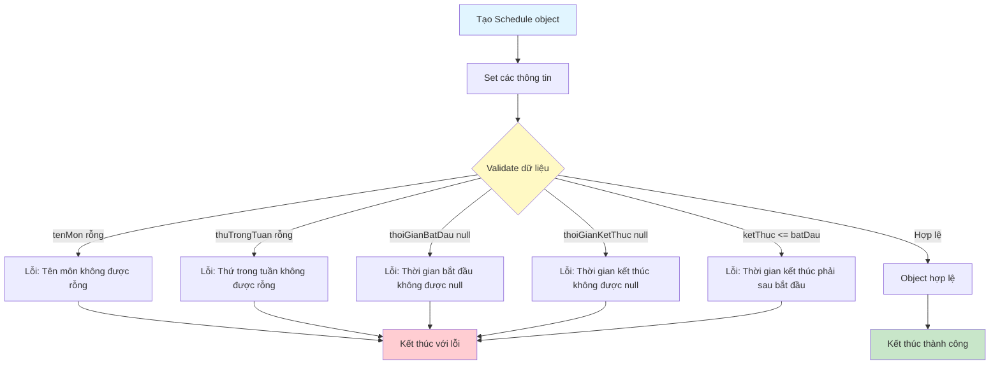

# Sơ Đồ Luồng Hoạt Động - Schedule Model

## Mô tả
Model class đại diện cho bảng schedules. Lưu trữ lịch học của sinh viên.

## Cấu Trúc Dữ Liệu

## Sơ Đồ Luồng - Khởi Tạo Object

## Sơ Đồ Luồng - Validate Dữ Liệu

## Chi Tiết Các Trường

### 1. id (int)
- ID tự động tăng của lịch học
- Được tạo bởi database khi insert

### 2. userId (int)
- ID của user sở hữu lịch học này
- Foreign key tham chiếu đến users.id

### 3. tenMon (String)
- Tên môn học
- Bắt buộc, không được rỗng

### 4. thuTrongTuan (String)
- Thứ trong tuần (Thứ 2, Thứ 3, ..., Chủ nhật)
- Bắt buộc, không được rỗng

### 5. thoiGianBatDau (Time)
- Thời gian bắt đầu học
- Bắt buộc, không được null
- Định dạng: HH:mm:ss

### 6. thoiGianKetThuc (Time)
- Thời gian kết thúc học
- Bắt buộc, không được null
- Phải sau thoiGianBatDau
- Định dạng: HH:mm:ss

### 7. phongHoc (String)
- Phòng học
- Tùy chọn, có thể null

### 8. ghiChu (String)
- Ghi chú về lịch học
- Tùy chọn, có thể null

### 9. createdAt (Timestamp)
- Thời gian tạo lịch học
- Được set tự động bởi database

