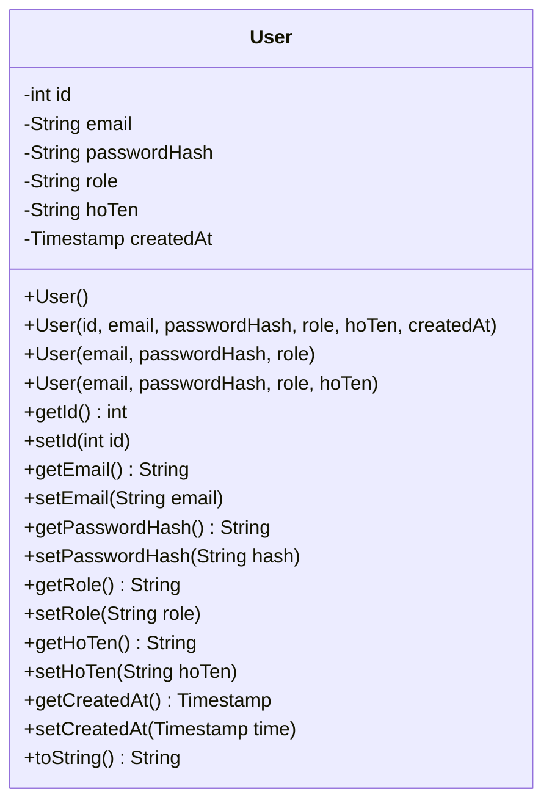
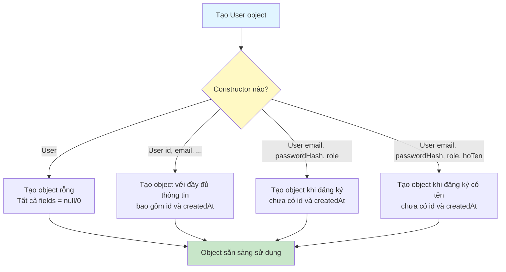
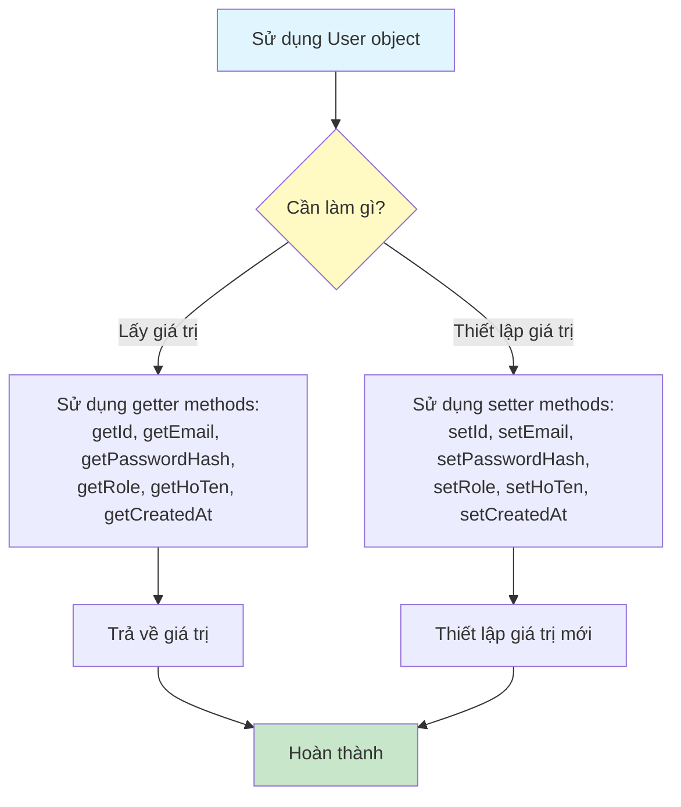

# Sơ Đồ Luồng Hoạt Động - User Model

## Mô tả
Model class đại diện cho bảng users. Lưu trữ thông tin tài khoản người dùng.

## Cấu Trúc Dữ Liệu

## Sơ Đồ Luồng - Khởi Tạo Object

## Sơ Đồ Luồng - Getter và Setter

## Chi Tiết Các Trường

### 1. id (int)
- ID tự động tăng của user
- Được tạo bởi database khi insert

### 2. email (String)
- Email đăng nhập của user
- Phải là duy nhất trong hệ thống

### 3. passwordHash (String)
- Mật khẩu đã được hash bằng BCrypt
- Không bao giờ lưu mật khẩu dạng plain text

### 4. role (String)
- Vai trò của user trong hệ thống
- Mặc định là "student"

### 5. hoTen (String)
- Họ và tên của user
- Có thể null

### 6. createdAt (Timestamp)
- Thời gian tạo tài khoản
- Được set tự động bởi database

## Các Constructor

1. **User()**: Constructor mặc định, tạo object rỗng
2. **User(id, email, passwordHash, role, hoTen, createdAt)**: Constructor đầy đủ, dùng khi đọc từ database
3. **User(email, passwordHash, role)**: Constructor khi tạo user mới, chưa có id và createdAt
4. **User(email, passwordHash, role, hoTen)**: Constructor khi tạo user mới có tên, chưa có id và createdAt

