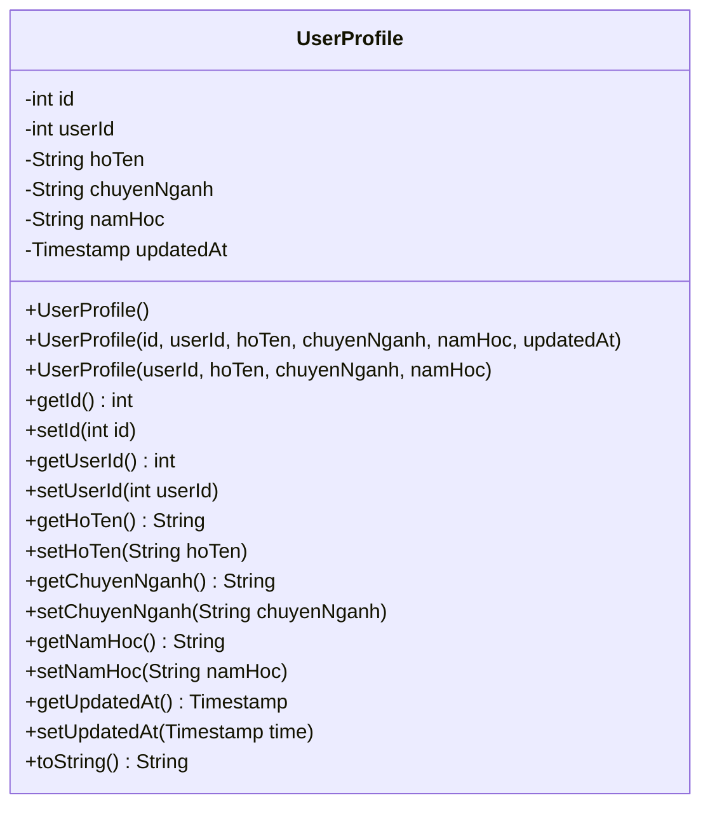
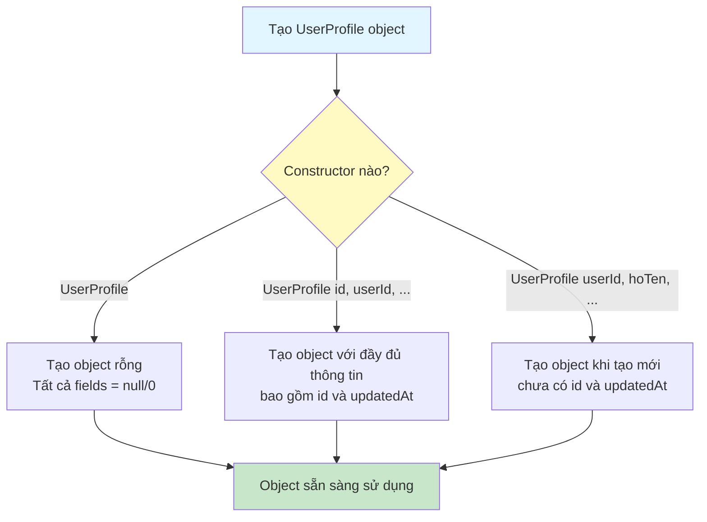
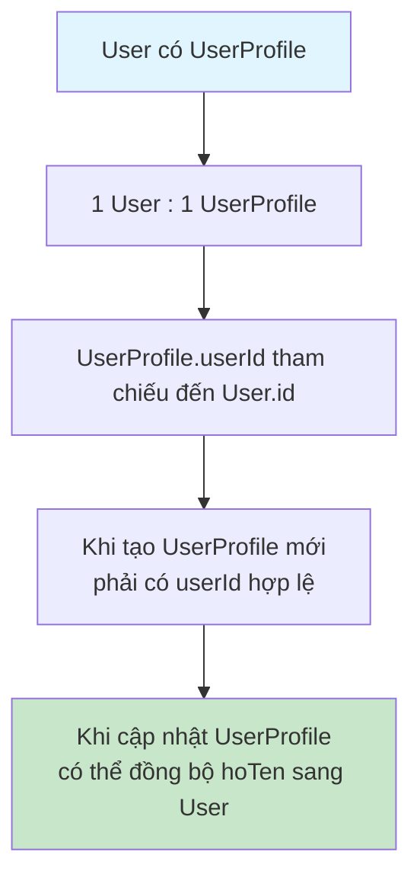

# Sơ Đồ Luồng Hoạt Động - UserProfile Model

## Mô tả
Model class đại diện cho bảng user_profiles. Lưu trữ thông tin hồ sơ cá nhân của sinh viên.

## Cấu Trúc Dữ Liệu

## Sơ Đồ Luồng - Khởi Tạo Object

## Sơ Đồ Luồng - Mối Quan Hệ Với User

## Chi Tiết Các Trường

### 1. id (int)
- ID tự động tăng của profile
- Được tạo bởi database khi insert

### 2. userId (int)
- ID của user sở hữu profile này
- Foreign key tham chiếu đến users.id
- Mỗi user chỉ có một profile

### 3. hoTen (String)
- Họ và tên của sinh viên
- Có thể null
- Có thể đồng bộ với User.hoTen

### 4. chuyenNganh (String)
- Chuyên ngành học của sinh viên
- Có thể null

### 5. namHoc (String)
- Năm học hiện tại của sinh viên
- Có thể null

### 6. updatedAt (Timestamp)
- Thời gian cập nhật profile lần cuối
- Được set tự động bởi database khi update

## Các Constructor

1. **UserProfile()**: Constructor mặc định, tạo object rỗng
2. **UserProfile(id, userId, hoTen, chuyenNganh, namHoc, updatedAt)**: Constructor đầy đủ, dùng khi đọc từ database
3. **UserProfile(userId, hoTen, chuyenNganh, namHoc)**: Constructor khi tạo profile mới, chưa có id và updatedAt

