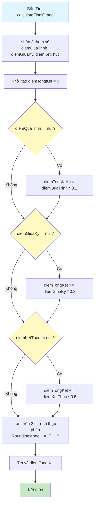
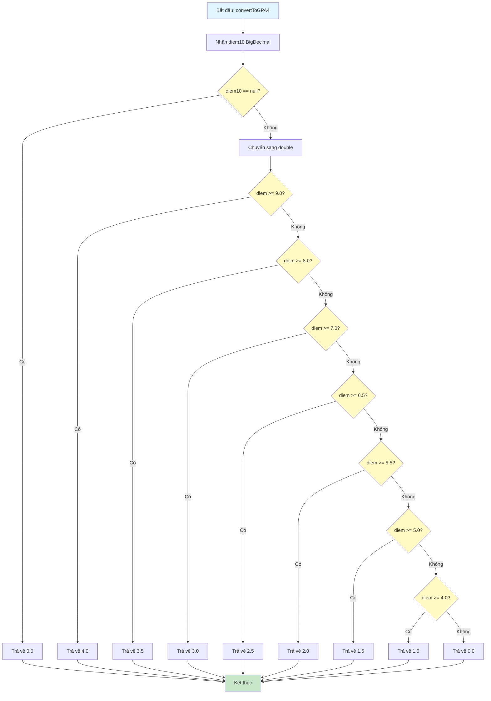
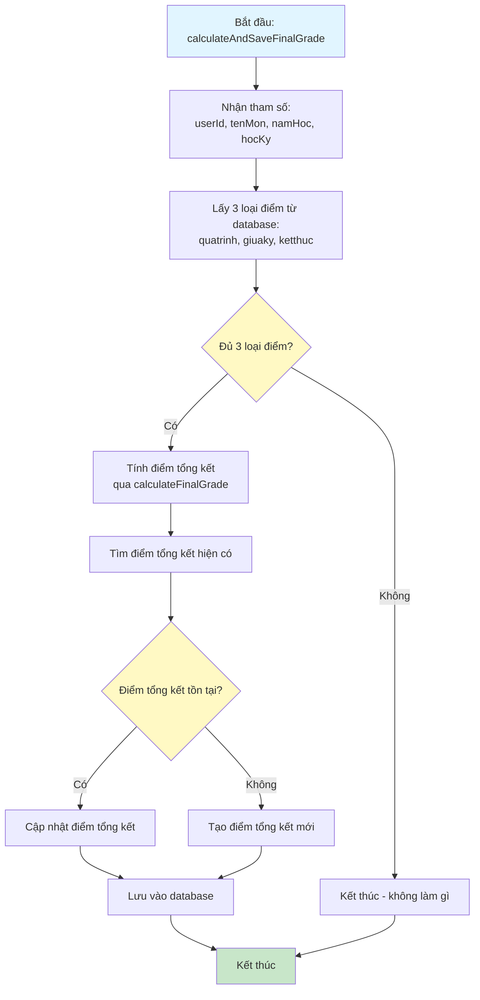
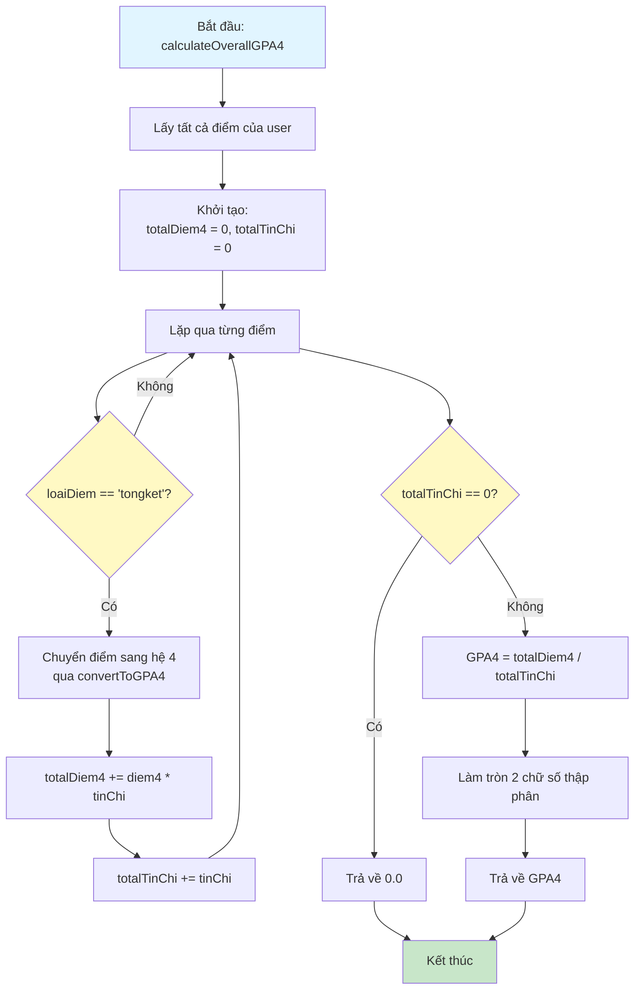
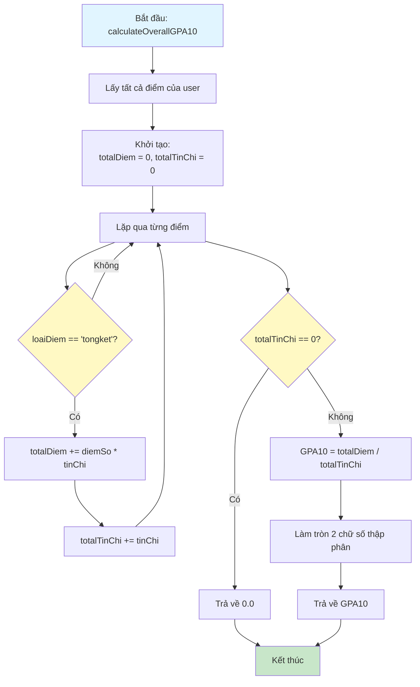

# Sơ Đồ Luồng Hoạt Động - GPAService

## Mô tả
Service tính toán GPA (Grade Point Average) cho sinh viên. Xử lý tính điểm tổng kết và chuyển đổi điểm hệ 10 sang hệ 4.

## Sơ Đồ Luồng - Phương Thức calculateFinalGrade

## Sơ Đồ Luồng - Phương Thức convertToGPA4

## Sơ Đồ Luồng - Phương Thức calculateAndSaveFinalGrade

## Sơ Đồ Luồng - Phương Thức calculateOverallGPA4

## Sơ Đồ Luồng - Phương Thức calculateOverallGPA10

## Chi Tiết Các Bước

### 1. Tính Điểm Tổng Kết
- Công thức: quatrinh * 0.2 + giuaky * 0.3 + ketthuc * 0.5
- Làm tròn 2 chữ số thập phân
- Hỗ trợ các trường hợp thiếu điểm (null)

### 2. Chuyển Đổi Điểm Hệ 4
- Thang điểm chuyển đổi:
  - 9.0 - 10.0 → 4.0
  - 8.0 - 8.9 → 3.5
  - 7.0 - 7.9 → 3.0
  - 6.5 - 6.9 → 2.5
  - 5.5 - 6.4 → 2.0
  - 5.0 - 5.4 → 1.5
  - 4.0 - 4.9 → 1.0
  - < 4.0 → 0.0

### 3. Tính GPA Tổng
- Chỉ tính từ điểm tổng kết (loaiDiem = 'tongket')
- Công thức: Tổng (điểm * tín chỉ) / Tổng tín chỉ
- Làm tròn 2 chữ số thập phân

### 4. Tự Động Tính Điểm Tổng Kết
- Khi môn học có đủ 3 loại điểm, tự động tính và lưu điểm tổng kết
- Nếu đã có điểm tổng kết, cập nhật lại
- Nếu chưa có, tạo mới

