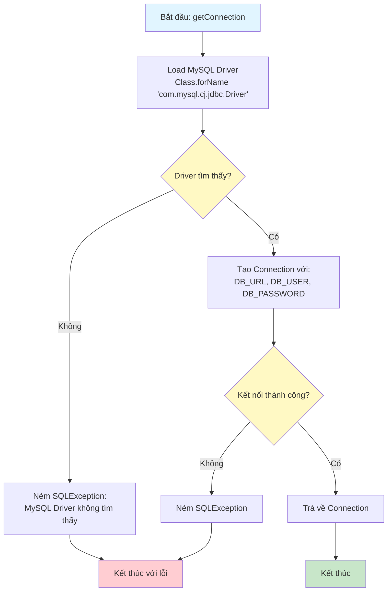
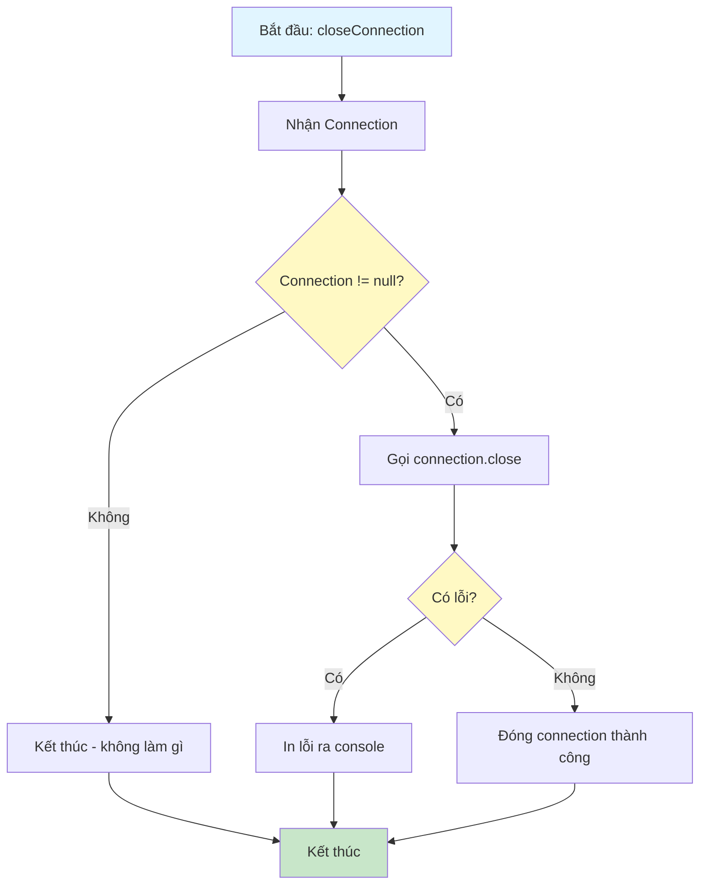
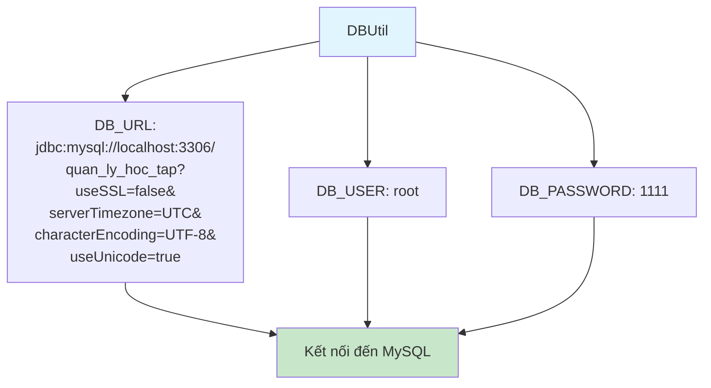

# Sơ Đồ Luồng Hoạt Động - DBUtil

## Mô tả
Utility class để quản lý kết nối database. Cung cấp method getConnection() để lấy Connection đến MySQL.

## Sơ Đồ Luồng - Phương Thức getConnection

## Sơ Đồ Luồng - Phương Thức closeConnection

## Cấu Hình Database

## Chi Tiết Các Bước

### 1. Load Driver
- Sử dụng `Class.forName()` để load MySQL JDBC Driver
- Driver phải có trong classpath (thường qua Maven dependency)

### 2. Tạo Connection
- Sử dụng `DriverManager.getConnection()` với:
  - URL: jdbc:mysql://localhost:3306/quan_ly_hoc_tap
  - User: root
  - Password: 1111
- Các tham số URL:
  - useSSL=false: Tắt SSL
  - serverTimezone=UTC: Múi giờ UTC
  - characterEncoding=UTF-8: Encoding UTF-8
  - useUnicode=true: Hỗ trợ Unicode

### 3. Xử Lý Lỗi
- Nếu không tìm thấy driver, ném SQLException
- Nếu kết nối thất bại, ném SQLException
- Các exception được propagate lên caller

### 4. Đóng Connection
- Helper method để đóng connection an toàn
- Kiểm tra null trước khi đóng
- Bắt và log lỗi nếu có

### 5. Lưu Ý
- Connection nên được đóng sau khi sử dụng
- Sử dụng try-with-resources để tự động đóng
- Thông tin kết nối nên được config từ file properties (hiện tại hardcode)

