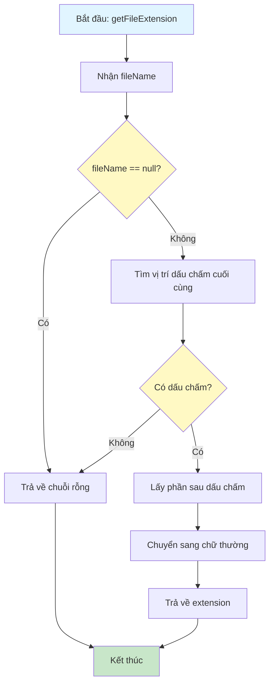
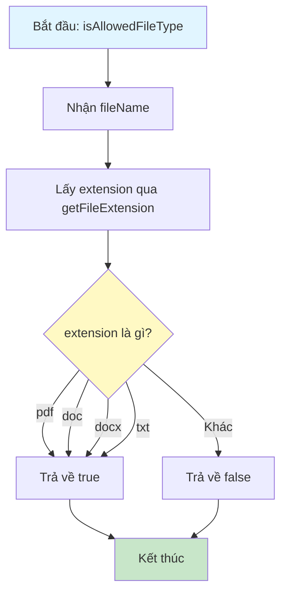
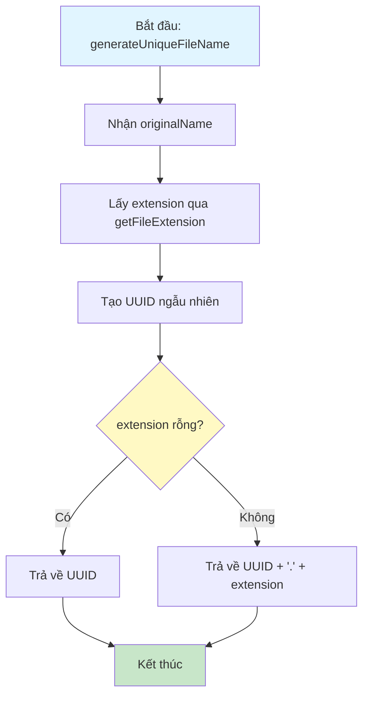
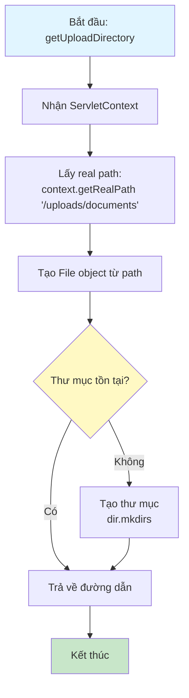
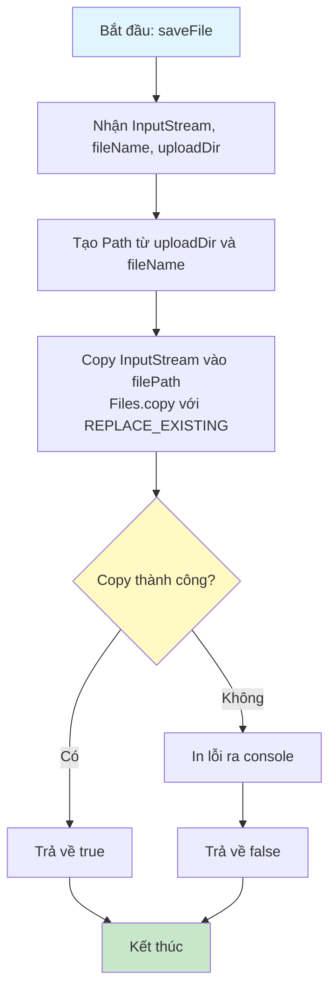
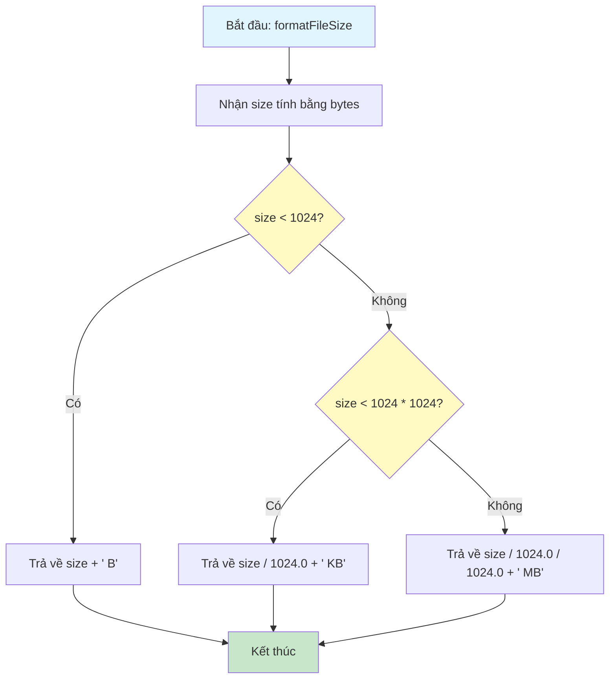

# Sơ Đồ Luồng Hoạt Động - FileUtil

## Mô tả
Utility class để xử lý file upload và quản lý file trên server.

## Sơ Đồ Luồng - Phương Thức getFileExtension

## Sơ Đồ Luồng - Phương Thức isAllowedFileType

## Sơ Đồ Luồng - Phương Thức generateUniqueFileName

## Sơ Đồ Luồng - Phương Thức getUploadDirectory

## Sơ Đồ Luồng - Phương Thức saveFile

## Sơ Đồ Luồng - Phương Thức formatFileSize

## Chi Tiết Các Bước

### 1. Lấy Extension
- Tìm dấu chấm cuối cùng trong tên file
- Lấy phần sau dấu chấm
- Chuyển sang chữ thường để so sánh

### 2. Kiểm Tra Loại File
- Chỉ cho phép: pdf, doc, docx, txt
- Các loại file khác bị từ chối

### 3. Tạo Tên File Duy Nhất
- Sử dụng UUID để tạo tên file ngẫu nhiên
- Giữ nguyên extension của file gốc
- Đảm bảo không trùng lặp

### 4. Quản Lý Thư Mục Upload
- Thư mục: /uploads/documents
- Tự động tạo thư mục nếu chưa tồn tại
- Sử dụng ServletContext để lấy real path

### 5. Lưu File
- Sử dụng Files.copy() để copy InputStream vào file
- REPLACE_EXISTING: Ghi đè nếu file đã tồn tại
- Xử lý exception và trả về boolean

### 6. Format Kích Thước
- < 1024 bytes: Hiển thị B
- < 1024 KB: Hiển thị KB (2 chữ số thập phân)
- >= 1024 KB: Hiển thị MB (2 chữ số thập phân)

