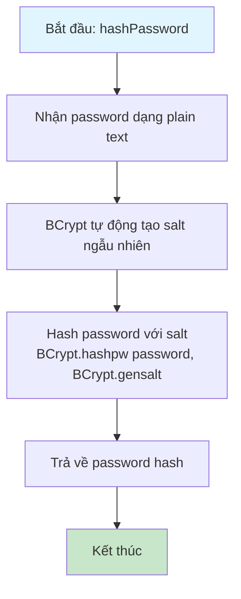
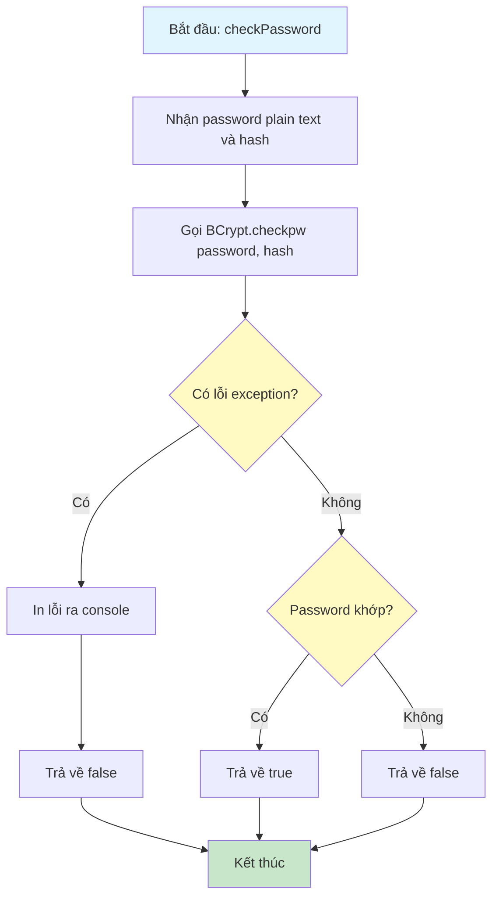
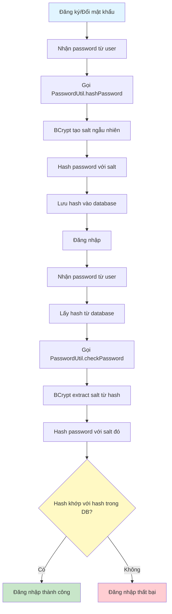

# Sơ Đồ Luồng Hoạt Động - PasswordUtil

## Mô tả
Utility class để xử lý mã hóa và kiểm tra mật khẩu. Sử dụng BCrypt để hash password.

## Sơ Đồ Luồng - Phương Thức hashPassword

## Sơ Đồ Luồng - Phương Thức checkPassword

## Sơ Đồ Luồng - Quy Trình Hash và Verify

## Chi Tiết Các Bước

### 1. Hash Password
- Sử dụng BCrypt để hash password
- BCrypt tự động tạo salt ngẫu nhiên cho mỗi password
- Salt được embed trong hash string
- Mỗi lần hash cùng một password sẽ cho kết quả khác nhau (do salt khác nhau)

### 2. Verify Password
- BCrypt tự động extract salt từ hash
- Hash password input với salt đó
- So sánh với hash trong database
- Trả về true nếu khớp, false nếu không khớp

### 3. Bảo Mật
- Không bao giờ lưu password dạng plain text
- BCrypt là one-way hash, không thể reverse
- Salt ngẫu nhiên ngăn chặn rainbow table attacks
- Work factor mặc định của BCrypt là 10 (có thể tùy chỉnh)

### 4. Xử Lý Lỗi
- Bắt exception khi check password
- Trả về false nếu có lỗi
- Log lỗi ra console để debug

### 5. Lưu Ý
- BCrypt hash có độ dài cố định (60 ký tự)
- Format: $2a$10$... (version, cost, salt+hash)
- Cost factor 10 nghĩa là 2^10 = 1024 iterations

